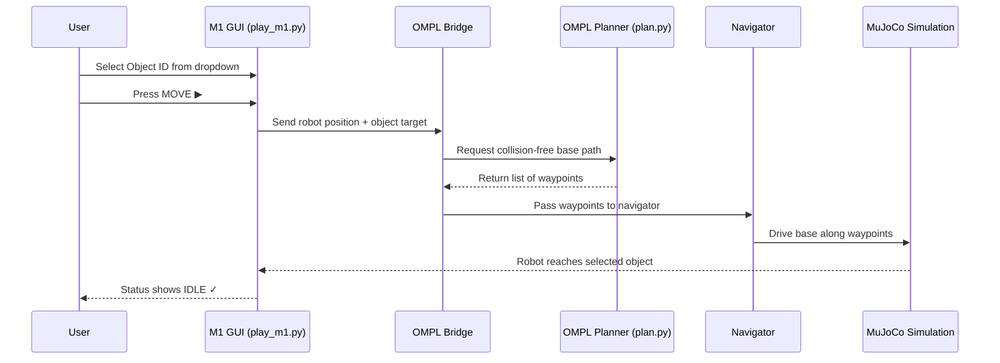

# M1 OMPL Object Navigation

<p align="center">
https://github.com/user-attachments/assets/42763aa0-9ef5-449a-b3e7-d32c80e5af17
</p>

<p align="center">▶ <strong>Watch: Full GUI Walkthrough</strong> — object selection, MOVE button, and live OMPL base navigation</p>

<p align="center">
  <strong>Autonomous object navigation for the MORPH-I mobile manipulator using OMPL path planning in MuJoCo.</strong>
</p>

<p align="center">
  Python · MuJoCo · ImGui/GLFW · OMPL (Open Motion Planning Library)
</p>

---

## Table of Contents

- [What This Project Does](#what-this-project-does)
- [Video Demos](#video-demos)
- [The Scene](#the-scene)
- [The Robot — MORPH-I (M1)](#the-robot--morph-i-m1)
- [GUI Panel — Complete Reference](#gui-panel--complete-reference)
  - [PICK & PLACE Section](#1-pick--place-section-main-workflow)
  - [Robot Arms Section](#2-robot-arms-section)
  - [Grippers Section](#3-grippers-section)
  - [Simulation Controls](#4-simulation-controls)
  - [Joystick](#5-joystick)
  - [Bottom Status Bar](#6-bottom-status-bar)
- [3D Camera Controls](#3d-camera-controls)
- [Quick Start](#quick-start)
- [Step-by-Step Demonstration](#step-by-step-demonstration)
- [How It Works Internally](#how-it-works-internally)
- [Visual Guide](#visual-guide)
- [Troubleshooting](#troubleshooting)
- [Key Files](#key-files)
- [Current Scope & Boundaries](#current-scope--boundaries)
- [Acknowledgements](#acknowledgements)

---

## What This Project Does

This repository implements **autonomous object navigation** for the **MORPH-I** (M1) mobile manipulator robot in a MuJoCo simulation.

The user opens a GUI, selects a target object (for example, a can of Pepsi Max), presses **MOVE**, and the robot automatically calculates a collision-free path and drives its base toward the selected object. The path planning is handled by **OMPL** (Open Motion Planning Library) — a well-known library used in professional robotics for computing safe paths that avoid obstacles.

**In simple terms**: You pick an object → press a button → the robot drives itself to that object.

---

## Video Demos

Below are demonstration videos of the OMPL-based navigation in action.

<p align="center">
  <table border="0">
    <tr>
      <td align="center" width="50%">
        <strong>1. Perspective View (GUI)</strong><br>
        https://github.com/user-attachments/assets/dde71c04-72fd-4ab9-8e5d-97656738ded6
        <br>
        <em>Full recording of the GUI and robot navigation.</em>
      </td>
      <td align="center" width="50%">
        <strong>2. Top-Down View</strong><br>
        https://github.com/user-attachments/assets/034b1e6d-49c2-4bee-a92e-144ae6dffd88
        <br>
        <em>Clear view of the planned path through obstacles.</em>
      </td>
    </tr>
  </table>
</p>

---

## The Scene

When you launch the simulation, you will see a **market-world environment** containing:

- **The MORPH-I robot** — a 4-wheeled mobile base with two parallel manipulator arms and 3-finger grippers.
- **10 pickup objects** — randomly placed product items (cans, boxes, cereal) on the floor. Each object has a unique color and numbered label visible in the 3D scene.
- **10 shelf slots** — organized on shelves at different heights (low, mid, high). These represent where objects would be placed in a future phase.
- **Numbered markers** — small colored circles floating above each object and shelf slot for easy identification.

The selected object is highlighted with a bright yellow glow and a ring around its marker. The selected shelf slot is highlighted in green.

---

## The Robot — MORPH-I (M1)

The M1 robot in this simulation is a **MORPH-I** — a 4-wheeled omnidirectional mobile base carrying dual independent parallel manipulators.

| Component | Description |
| --- | --- |
| **Mobile Base** | 4-wheel omnidirectional (mecanum) drive. Can move in any direction without turning first. |
| **Left Arm (ARM1)** | Parallel manipulator with 2 prismatic columns (H1, H2), 1 horizontal extension (A1), and 1 revolute base joint (TH). |
| **Right Arm (ARM2)** | Same configuration as ARM1, independently controlled. |
| **Grippers** | Two 3-finger grippers (one per arm), each controllable from 0% open to 100% closed. |

### Joint Configuration

| Joint | Type | Range | Function |
| --- | --- | --- | --- |
| H1 (per arm) | Prismatic | 0 – 1.5 m | Height of left vertical column |
| H2 (per arm) | Prismatic | 0 – 1.5 m | Height of right vertical column |
| A1 (per arm) | Prismatic | 0 – 0.7 m | Horizontal arm extension |
| TH (per arm) | Revolute | −90° – 90° | Yaw rotation of entire arm assembly |

> **Note**: For the M1 autonomous navigation workflow, only the **mobile base** is driven by the OMPL planner. The arms and grippers are available for manual control and future autonomous grasping phases.

---

## GUI Panel — Complete Reference

The GUI panel appears on the **top-left corner** of the window. It is divided into several sections from top to bottom:

<p align="center">
  
</p>

### 1. PICK & PLACE Section *(Main Workflow)*

<p align="center">
  
</p>

This is the **most important** section — it controls the autonomous navigation.

| Element | What It Does |
| --- | --- |
| **Object ID** dropdown | Choose the target object the robot should navigate toward. Each object has a name (e.g., `Obj-4 [Nestle Candy]`) and a color swatch next to it. The object's current 3D position is shown below the dropdown. |
| **Shelf Slot ID** dropdown | Choose a shelf slot as task context. Each slot shows its height category (low/mid/high) and Z-coordinate. This is **informational only** in the current phase — the robot does not autonomously place objects on shelves yet. |
| **MOVE ▶** button | **Press this to start autonomous navigation.** The robot will plan a collision-free path using OMPL and drive toward the selected object. The button turns **yellow** and shows "Moving…" while navigation is in progress. |
| **Status text** | Below the MOVE button, the GUI shows the current state: `● Navigating to object…` (yellow), `● Grasping object…` (orange), `● Holding Obj-X` (green), or the last action result. |
| **Cancel** button | Appears during navigation. Click to stop the robot immediately. |
| **Release** button | Appears when the robot is holding an object. Click to release it. |

### 2. Robot Arms Section

<p align="center">
  
</p>

The GUI has sliders for both arms (**ARM1** = left, **ARM2** = right):

| Mode | Controls | Description |
| --- | --- | --- |
| **IK Control** ☑ (checked) | X, Y, Z sliders per arm | Move the end-effector (gripper tip) to a target position in 3D space. The inverse kinematics solver computes the required joint angles automatically. |
| **IK Control** ☐ (unchecked) | H1, H2, A1, TH sliders per arm | Directly control each joint: **H1/H2** = column heights (−75° to 75°), **A1** = horizontal arm extension (−45° to 45°), **TH** = base rotation (−90° to 90°). |

> **Note**: The arm controls are available for manual inspection and testing. They are **not required** for the autonomous object-navigation workflow.

### 3. Grippers Section

<p align="center">
  
</p>

| Control | Description |
| --- | --- |
| **Left** slider (0%–100%) | Controls the left gripper. 0% = fully open, 100% = fully closed. |
| **Right** slider (0%–100%) | Controls the right gripper. 0% = fully open, 100% = fully closed. |

### 4. Simulation Controls

<p align="center">
  
</p>

| Button / Checkbox | What It Does |
| --- | --- |
| **Pause** checkbox | Freezes the MuJoCo physics simulation. The GUI remains interactive, but the robot and objects stop moving. Uncheck to resume. |
| **Reset Robot** button | Returns the robot to its starting position and cancels any active navigation or grasp. |
| **Respawn Objects** button | Randomizes the positions and sizes of all 10 objects on the floor. Useful for testing with different layouts. |

### 5. Joystick

<p align="center">
  
</p>

A circular joystick widget at the bottom of the control panel:

| Area | How to Use | What It Does |
| --- | --- | --- |
| **Inner circle** | Click and drag inside the small circle | Moves the robot base forward/backward/sideways (translation). |
| **Outer ring** | Click and drag on the ring edge | Rotates the robot base left/right (yaw). |
| **Orange dot** on the ring | Automatic | Shows the robot's current heading direction. |

Below the joystick, you can see the current base position: `Base → X:3.16 Y:-5.51 Yaw:90.0°`

> **Note**: The joystick is for **manual repositioning only**. For the autonomous demo, use the `MOVE ▶` button instead.

### 6. Bottom Status Bar

<p align="center">
  
</p>

A dark bar at the very bottom of the window showing:

- **Left side**: The currently selected object name and color (e.g., `Object: Obj-4 [Nestle Candy]`).
- **Center**: The currently selected shelf slot (e.g., `Shelf: Slot-3 [row=low z=0.50m]`).
- **Right side**: The current robot state — `IDLE` (green), `● MOVING` (yellow), `● GRASPING` (orange), or `● HOLDING` (green).

---

## 3D Camera Controls

Use these mouse controls to look around the MuJoCo simulation scene:

| Action | Mouse Input |
| --- | --- |
| **Rotate** the view | Left-click and drag |
| **Pan / Move** the view | Right-click and drag |
| **Zoom** in/out | Scroll wheel, or middle-click and drag |

> **Tip**: Keep the camera stable during the autonomous demo so you can clearly see the robot moving along its path.

---

## Quick Start

### 1. System Dependencies

This project requires **Ubuntu 22.04** with Python 3.10 and OpenGL rendering libraries.

```bash
sudo apt-get update
sudo apt-get install -y python3.10 python3.10-venv python3-pip libgl1 libglfw3 libglew2.2 libosmesa6 ffmpeg
```

> **Why Python 3.10?** The OMPL planning library is distributed as a Python wheel that is compiled for specific Python versions. Python 3.10 matches the available OMPL wheel.

### 2. Create Virtual Environment

```bash
cd motion-planning
python3.10 -m venv .venv
.venv/bin/python -m pip install --upgrade pip
.venv/bin/python -m pip install -r requirements.txt
```

### 3. Verify Installation

Run the smoke test to check that all dependencies and MuJoCo scene files are correctly installed:

```bash
PYTHONPATH=src .venv/bin/python tools/smoke_test.py
```

You should see `[OK]` for each import (mujoco, glfw, imgui, numpy, ompl) and a successful XML load message.

### 4. Launch the M1 GUI

```bash
OMPL_BRIDGE_MODE=native PYTHONPATH=src .venv/bin/python src/gui/play_m1.py
```

A window will open showing the market-world scene with the robot and scattered objects.

---

## Step-by-Step Demonstration

Follow this exact sequence to see the autonomous navigation in action:

1. **Launch** the GUI using the command in step 4 above. Wait for the market-world scene to fully load.
2. **Look around** the scene using the camera controls (left-click drag to rotate, scroll to zoom). You should see numbered colored circles floating above each object.
3. **Select a target object**: In the GUI panel, find the **Object ID** dropdown under the PICK & PLACE header. Click on it and choose an object (e.g., `Obj-4 [Nestle Candy]`). The selected object will light up yellow in the 3D scene.
4. **Optionally select a shelf slot**: Open the **Shelf Slot ID** dropdown and pick a slot. This is informational context only — no shelf placement happens yet.
5. **Press MOVE ▶**: Click the green **MOVE** button. It will turn yellow and display "Moving…".
6. **Watch the planning**: The terminal will print OMPL planning messages (e.g., `[OMPL] 40 waypoints from OMPL`). The GUI status will show `● Navigating to object…`.
7. **Observe the robot**: The robot base will start following the planned waypoints, moving toward the selected object. Keep the camera stable for a clear view.
8. **Completion**: When the robot reaches the target, the status returns to `IDLE`.
9. **Try again**: Click **Respawn Objects** to randomize the layout, select a different object, and press **MOVE** again.

---

## How It Works Internally



**What each component does:**

- **play_m1.py** — The GUI. Handles user interaction, displays the scene, and coordinates the workflow.
- **ompl_windows_bridge.py** — Calls the OMPL planner. Supports both native Linux mode and Windows WSL mode.
- **plan.py** — The actual OMPL planner. Builds a collision-aware search space and returns a path as a list of (x, y) waypoints.
- **ompl_navigator.py** — Takes the waypoint list and drives the robot base from point to point in the simulation.
- **grasp_controller.py** — Prototype grasp logic (approach + attach object). Not required for the navigation demo.

---

## Visual Guide

| Step | Preview | What To Look For |
| --- | --- | --- |
| **1. Select object** |  | Object labels visible in the scene. The selected object is highlighted. The PICK & PLACE panel shows the Object ID dropdown and Shelf Slot ID dropdown. |
| **2. Navigate** |  | After pressing MOVE, the robot base moves along the planned path toward the selected object. The status bar shows MOVING. |
| **3. Prototype status** |  | After navigation completes, the GUI may show grasp-related status. This is prototype behavior — full pick-and-place validation is a future phase. |

---

## Troubleshooting

| Symptom | Cause | Fix |
| --- | --- | --- |
| `python3.10: command not found` | Python 3.10 is not installed | Install it: `sudo apt install python3.10 python3.10-venv` |
| `.venv/bin/python: not found` | Virtual environment not created | Run the setup commands from the repo root |
| `ModuleNotFoundError` for any package | Dependencies missing | Run: `.venv/bin/python -m pip install -r requirements.txt` |
| `import ompl` fails in smoke test | OMPL wheel not compatible with your Python version | Use Python 3.10 and recreate `.venv` from scratch |
| GUI window does not open | No display server or missing OpenGL | Run from a desktop session (not SSH). Install: `sudo apt install libgl1 libglfw3` |
| GUI does not open in WSL2 | WSL GUI support not configured | Use Windows 11 with WSLg, or configure an X server |
| `MOVE` does nothing | OMPL unavailable or planning failed | Run the smoke test first. Check terminal for `[OMPL]` error messages |
| Robot does not move after pressing MOVE | Target may be unreachable | Try **Respawn Objects** to change the layout, then try again |
| Objects don't go to shelves | Expected — not implemented yet | Shelf placement is task context for a future phase |

---

## Key Files

| Path | Purpose |
| --- | --- |
| `src/gui/play_m1.py` | Main M1 GUI — object selection, status display, and navigation launch |
| `src/navigation/plan.py` | OMPL planner — generates collision-free base waypoints |
| `src/navigation/ompl_windows_bridge.py` | Environment bridge — calls the planner in native Linux or WSL mode |
| `src/navigation/ompl_navigator.py` | Waypoint follower — drives the robot base along the planned path |
| `src/navigation/grasp_controller.py` | Prototype grasp logic — approach and attach object (future validation) |
| `src/simulations/morph_i_free_move.py` | Core MORPH-I simulation engine used by the M1 GUI |
| `src/env/market_world_m1.xml` | MuJoCo scene definition — market world with shelves and floor zones |
| `tools/smoke_test.py` | Dependency and MuJoCo XML validation script |
| `requirements.txt` | Python package dependencies |

---

## Current Scope & Boundaries

| Feature | Status |
| --- | --- |
| M1 market-world scene loading | ✅ Implemented |
| Object labels and colored markers in 3D scene | ✅ Implemented |
| Object selection via GUI dropdown | ✅ Implemented |
| Shelf slot selection (task context) | ✅ Implemented (display only) |
| OMPL collision-aware base path planning | ✅ Implemented |
| Waypoint-following base navigation | ✅ Implemented |
| Manual arm/gripper control via GUI | ✅ Implemented |
| Manual base control via joystick | ✅ Implemented |
| Autonomous grasp and carry | 🔶 Prototype — requires validation |
| Autonomous shelf placement | 🔶 Planned for future phase |
| ROS 2 / MoveIt2 integration | ❌ Not in this repository |

**What is OMPL?**
OMPL stands for *Open Motion Planning Library*. It is a widely-used open-source library for computing collision-free paths for robots. In this project, OMPL calculates the safe route for the robot base to travel from its current position to the selected object, avoiding walls and shelves.

---

## Acknowledgements

- **Kitchen assets** from [furniture_sim by vikashplus](https://github.com/vikashplus/furniture_sim)
- **Market product assets** from [Scanned Objects MuJoCo Models by kevinzakka](https://github.com/kevinzakka/mujoco_scanned_objects)
- **Mecanum wheel mobile base** from [Mecanum Drive in MuJoCo by JunHeonYoon](https://github.com/JunHeonYoon/mujoco_mecanum)
- **Gripper (3-finger)** from [DELTO_M_ROS2 by tesollodelto](https://github.com/tesollodelto/delto_m_ros2/tree/jazzy-dev)
