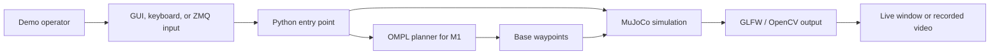

# MORPH Motion Planning Simulation

<p align="center">
  
</p>

<p align="center">
  <strong>MuJoCo-based motion-planning and control demos for the MORPH mobile manipulator.</strong>
</p>

<p align="center">
  Native Python setup | GUI teleoperation | Scripted trajectories | OMPL-assisted object navigation
</p>

## What This Repository Provides

This repository is a runnable simulation package for MORPH mobile-manipulator workflows. It includes MuJoCo scenes, Python simulation entry points, an ImGui/GLFW control interface, scripted trajectory demos, ZMQ command publishing, and an M1 object-navigation demo that uses OMPL for base planning.

The repository is organized so the front page stays easy to scan. Detailed setup, control, and troubleshooting information is split into focused documents under `docs/`.

## Quick Start

Check that Python 3.10 is available, then create a virtual environment and install the project dependencies.

From the repository root, run:

```bash
python3.10 --version
make setup
make smoke
make gui
```

The Makefile creates `.venv` and runs the demo commands with `.venv/bin/python`. If you prefer direct Python commands, activate the environment first with `source .venv/bin/activate`.

On Linux, GLFW/OpenGL windows also require desktop display libraries. If GUI windows do not open, install the system packages listed in [docs/RUNNING_DEMOS.md](docs/RUNNING_DEMOS.md).

For detailed demo commands, controls, and troubleshooting, see [docs/RUNNING_DEMOS.md](docs/RUNNING_DEMOS.md).

## Demo Gallery

| Demo | Preview | Run |
| --- | --- | --- |
| MORPH-I GUI teleoperation |  | `make gui` |
| MORPH-I free movement |  | `make morph-i` |
| MORPH-I market trajectory |  | `make traj-i` |
| MORPH-II free movement |  | `make morph-ii` |
| MORPH-II kitchen trajectory |  | `make traj-ii` |
| M1 object navigation |  | `make m1` |

Bundled demo video: [assets/mobile_manip_obotx.mp4](assets/mobile_manip_obotx.mp4)

Additional M1 demo videos:

| Video | Description |
| --- | --- |
| [M1 object navigation](assets/demo_m1_object_navigation.mp4) | Object selection, OMPL planning, and base movement toward the selected object. |
| [M1 object navigation top view](assets/demo_m1_object_navigation_top_view.mp4) | Top-view recording of the robot moving toward the selected object. |

## At A Glance

| Area | Details |
| --- | --- |
| Simulation engine | MuJoCo |
| Rendering modes | GLFW interactive windows and OpenCV recording mode |
| Main GUI | `src/gui/play.py` |
| M1 navigation GUI | `src/gui/play_m1.py` |
| Planner used by M1 | OMPL RRT* through `src/navigation/plan.py` |
| Preferred setup | Python virtual environment using `requirements.txt` |
| Verification command | `make smoke` |
| Main demo command | `make gui` |

## Available Workflows

| Workflow | Entry Point | Description |
| --- | --- | --- |
| MORPH-I GUI teleoperation | `src/gui/play.py` | Interactive control panel for base motion, dual arms, grippers, wrists, and hand bearings. |
| MORPH-I free movement | `src/simulations/morph_i_free_move.py` | Standalone MORPH-I simulation with GLFW and OpenCV modes. |
| MORPH-I market trajectory | `src/simulations/morph_i_market_trajectory.py` | Scripted market-world trajectory demo with trajectory and keyboard modes. |
| MORPH-II free movement | `src/simulations/morph_ii_free_move.py` | MORPH-II kitchen/free-move simulation. |
| MORPH-II kitchen trajectory | `src/simulations/morph_ii_kitchen_trajectory.py` | Scripted MORPH-II kitchen-world trajectory demo. |
| M1 object navigation | `src/gui/play_m1.py` | Object/shelf selection UI, OMPL base navigation, and waypoint following toward the selected object. |
| ZMQ topic control | `src/simulations/pubsub.py` | Command publisher for MORPH-I base, arm, IK, and direct-control topics. |

## How To Navigate The Repository

Read the repository in this order:

| Start Here | Use This For |
| --- | --- |
| `README.md` | High-level overview, gallery, quick start, and folder map. |
| [docs/PROJECT_OVERVIEW.md](docs/PROJECT_OVERVIEW.md) | System components, capability summary, and workflow diagrams. |
| [docs/RUNNING_DEMOS.md](docs/RUNNING_DEMOS.md) | Demo-specific commands, UI controls, ZMQ topics, and recording outputs. |

Use the README to understand the repository quickly. Use the focused docs when you need implementation details or step-by-step commands.

## Repository Structure

```text
motion-planning/
├── README.md                     # Public entry point and project guide
├── requirements.txt              # Local Python dependency list
├── Makefile                      # Short commands for local workflows
├── docs/
│   ├── PROJECT_OVERVIEW.md       # Architecture and capability explanation
│   └── RUNNING_DEMOS.md          # Demo commands and controls
├── tools/
│   └── smoke_test.py             # Import and MuJoCo XML validation check
├── assets/
│   ├── *.png                     # Documentation screenshots
│   └── *.mp4                     # Demo videos
└── src/
    ├── env/                      # MuJoCo worlds, robot XML, meshes, textures
    ├── gui/                      # ImGui/GLFW user interfaces
    │   ├── play.py               # Main MORPH-I GUI teleoperation
    │   └── play_m1.py            # M1 object navigation GUI
    ├── modules/                  # Shared pub/sub and trajectory helpers
    │   ├── pubsub.py
    │   └── trajectory_opt.py
    ├── navigation/               # OMPL bridge, planner, navigator, and grasp prototype
    │   ├── plan.py
    │   ├── ompl_windows_bridge.py
    │   ├── ompl_navigator.py
    │   └── grasp_controller.py
    └── simulations/              # Standalone MORPH-I and MORPH-II demos
        ├── morph_i_free_move.py
        ├── morph_ii_free_move.py
        ├── morph_i_market_trajectory.py
        ├── morph_ii_kitchen_trajectory.py
        └── pubsub.py
```

## System Flow



## Main Commands

| Command | Purpose |
| --- | --- |
| `make setup` | Create `.venv` with Python 3.10 and install Python dependencies. |
| `make smoke` | Verify Python imports, OMPL availability, and key MuJoCo XML files. |
| `make gui` | Run the main MORPH-I GUI. |
| `make m1` | Run the M1 OMPL object-navigation GUI. |
| `make morph-i` | Run MORPH-I free movement. |
| `make morph-ii` | Run MORPH-II free movement. |
| `make traj-i` | Run MORPH-I market trajectory. |
| `make traj-ii` | Run MORPH-II kitchen trajectory. |

## Requirements

Recommended:

- Ubuntu 22.04 or another Linux environment with Python 3.10.
- OpenGL-capable desktop session for GLFW windows.
- System OpenGL/GLFW libraries.

The M1 navigation demo uses OMPL Python bindings, which are included in `requirements.txt`. Python 3.10 is recommended because OMPL wheels are Python-version specific.

Windows users should use WSL2 with Ubuntu 22.04 and follow the same Linux setup steps. Native Windows setup is not the primary supported path for this handoff because MuJoCo GUI rendering, GLFW/OpenGL, and OMPL Python bindings are more reliable in a Linux environment.

Ubuntu 24.04 uses Python 3.12 by default. It can still be used if Python 3.10 is installed separately, but Ubuntu 22.04 is the lower-friction setup path for this repository.

## Current Scope

Implemented:

- MORPH-I and MORPH-II MuJoCo simulation demos.
- MORPH-I GUI teleoperation.
- Scripted market and kitchen trajectory demos.
- OpenCV recording mode for supported simulation scripts.
- M1 object selection and OMPL-assisted base navigation toward a selected object.
- Makefile shortcuts for local demo commands.

Current boundaries:

- The M1 UI includes a shelf selector for task context, but autonomous shelf placement is not part of the current workflow.
- The grasp/carry controller exists as prototype logic and should be validated before presenting the system as complete autonomous pick-and-place.
- ROS 2, MoveIt2, and Rerun integrations are outside this repository.
- GUI rendering depends on host display/GPU/OpenGL support.

## Detailed Run Guides

The README keeps only the common commands. Use the dedicated guides for full details:

- [docs/RUNNING_DEMOS.md](docs/RUNNING_DEMOS.md) for demo commands, controls, ZMQ topics, and recording outputs.
- [docs/PROJECT_OVERVIEW.md](docs/PROJECT_OVERVIEW.md) for architecture, capability details, and workflow diagrams.

## Troubleshooting

Common issues are documented in [docs/RUNNING_DEMOS.md](docs/RUNNING_DEMOS.md).

Useful starting points:

- Run `make smoke` before GUI demos.
- Use `PYTHONPATH=src .venv/bin/python ...` for direct Python commands.
- Use `--run cv --record` for MP4 recording modes.
