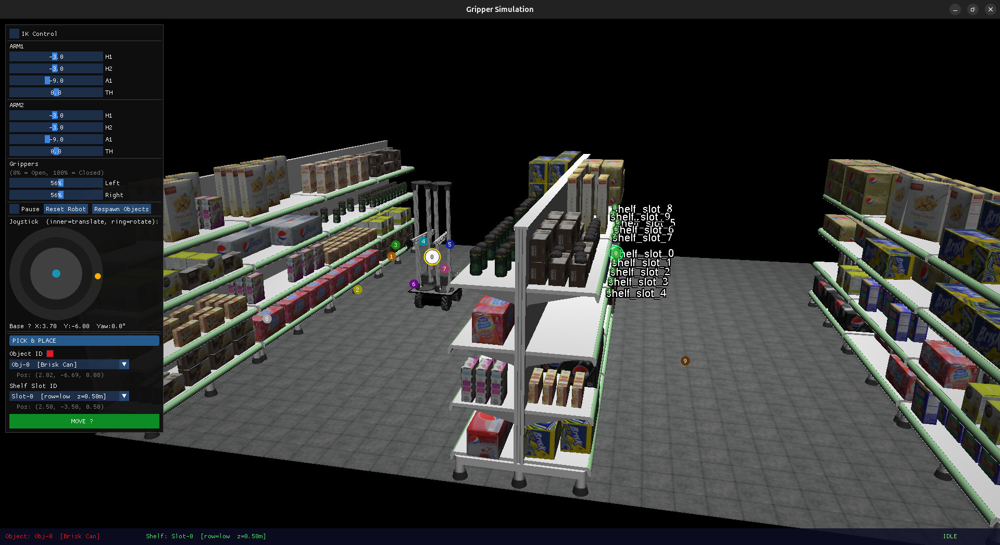
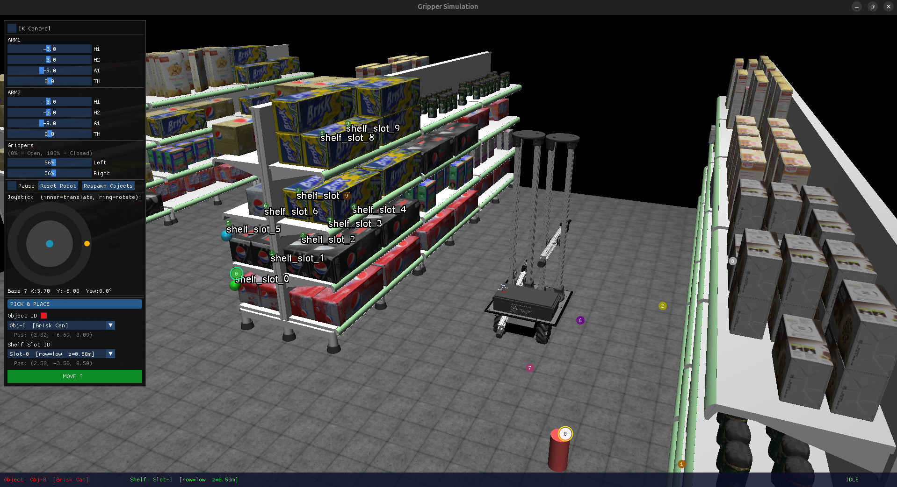
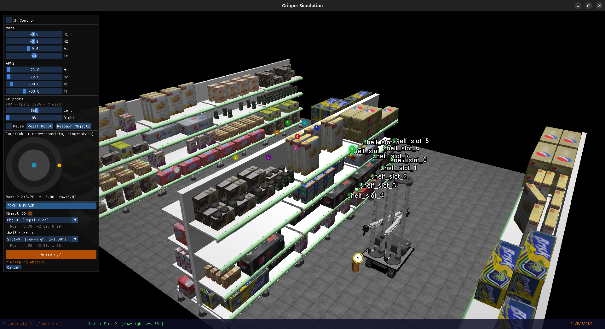
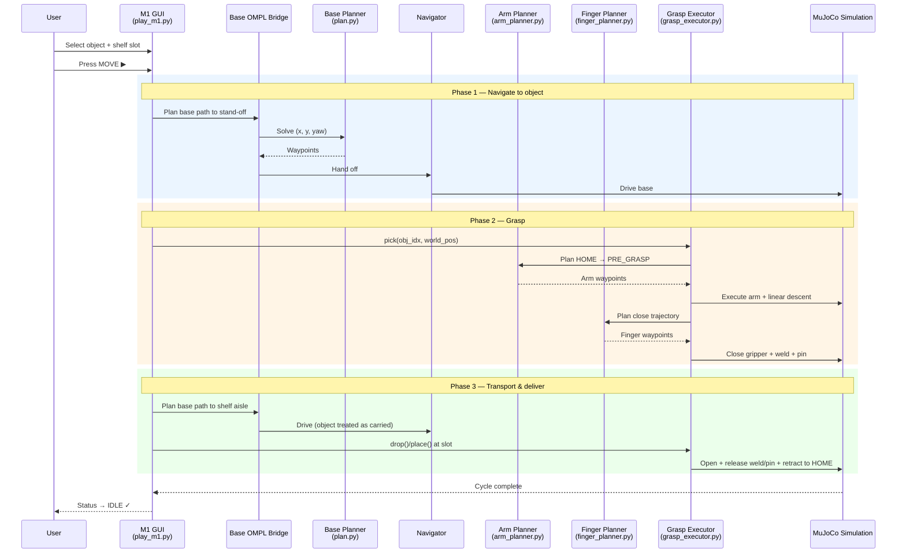
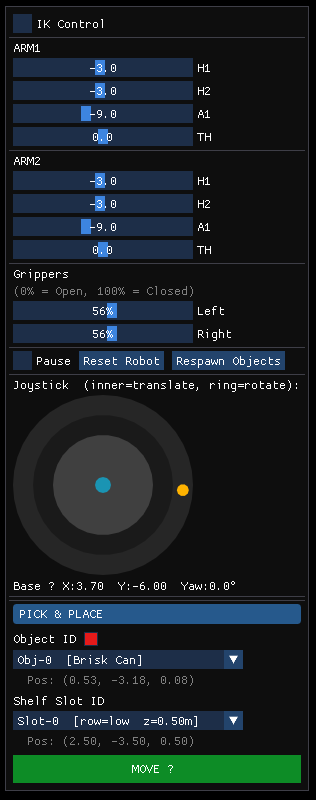
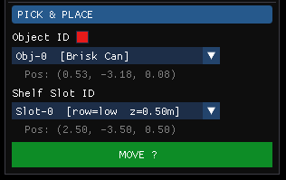
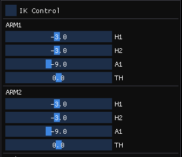
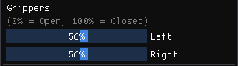
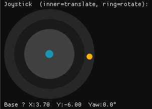

<h1 align="center">M1 OMPL Pick &amp; Place</h1>

<p align="center">
  <strong>End-to-end autonomous pick &amp; place for the MORPH-I mobile manipulator using OMPL motion planning in MuJoCo.</strong>
</p>

<p align="center">
  
  
  
  
  
</p>

https://github.com/user-attachments/assets/42763aa0-9ef5-449a-b3e7-d32c80e5af17

<p align="center"><em>▶ Full GUI walkthrough — object selection, MOVE button, OMPL base navigation, OMPL arm grasp, and shelf-side delivery.</em></p>

---

## ✨ Highlights

<table>
  <tr>
    <td align="center" width="33%">
      <strong>🚙 Base — OMPL planned</strong><br><br>
      <sub>RRT-based collision-free <code>(x, y, yaw)</code> path planning for the mecanum mobile base, with validated stand-off candidates next to the target object.</sub>
    </td>
    <td align="center" width="33%">
      <strong>🦾 Arm pickup — OMPL planned</strong><br><br>
      <sub>4-DOF parallel-manipulator planner (<code>H1, H2, A1, TH</code>) with per-state MuJoCo collision checks. Solves the <code>HOME → pre-grasp</code> approach and the transport paths — the pickup motion itself is <em>planned</em>, not scripted.</sub>
    </td>
    <td align="center" width="33%">
      <strong>✊ Fingers — OMPL planned</strong><br><br>
      <sub>RRT-Connect over the 11-DOF gripper joint space. Open and close trajectories that wrap the gripper around the object are produced by the planner — <em>not</em> configured by hand.</sub>
    </td>
  </tr>
</table>

> **Every motion stage is motion-planned.** Base navigation, arm pickup, and finger open/close are each solved by OMPL with their own collision-aware state space. No stage is hand-tuned, scripted, or manually configured.

> **One press, full cycle.** Pick an object → pick a shelf slot → press **MOVE**. The robot drives to the object, the arm plans and executes a real grasp (the gripper visibly closes around the object), the held object is transported to the assigned shelf-side aisle, released, and the arm returns to `HOME`.

---

## 📑 Table of Contents

- [Quick Start](#-quick-start)
  - [Option A — Docker (recommended)](#option-a--docker-recommended)
  - [Option B — Native install](#option-b--native-install)
- [Run Your First Pick &amp; Place](#-run-your-first-pick--place)
- [Video Demos](#-video-demos)
- [How It Works](#-how-it-works)
- [Project Layout](#-project-layout)
- [Reference Manual](#-reference-manual)
  - [The Scene](#the-scene)
  - [The Robot — MORPH-I](#the-robot--morph-i)
  - [GUI Panel](#gui-panel)
  - [3D Camera Controls](#3d-camera-controls)
- [Troubleshooting](#-troubleshooting)
- [FAQ](#-faq)
- [Scope &amp; Roadmap](#-scope--roadmap)
- [Acknowledgements](#-acknowledgements)

---

## 🚀 Quick Start

You can run this project two ways. **Docker is recommended** because it bundles every system and Python dependency in a reproducible container — you don't need to install Python, MuJoCo, OMPL, or GLFW on your host.

| Option | When to use it |
| --- | --- |
| 🅰 [Docker](#option-a--docker-recommended) | Fastest setup, works on any modern Linux desktop. Use this unless you have a specific reason not to. |
| 🅱 [Native install](#option-b--native-install) | You already have Python 3.10 and want full control over the environment. |

Both paths launch the same `src/gui/play_m1.py` GUI.

### Option A — Docker (recommended)

**Host requirements:** Linux with X11, Docker Engine 24+ with Compose, working OpenGL driver.

```bash
# 1. Allow Docker to draw on your X11 display (one-time per login session)
xhost +local:docker

# 2. Build the image (first build is 3-5 min; subsequent builds use cache)
docker compose -f docker/docker-compose.yml build

# 3. Launch the M1 OMPL GUI
docker compose -f docker/docker-compose.yml run --rm motion-planning \
    python3 src/gui/play_m1.py
```

A MuJoCo window opens with the market scene. See [`docker/README.md`](docker/README.md) for X11 permissions, GPU passthrough, UID/GID mapping, and other entry points.

### Option B — Native install

Requires **Ubuntu 22.04** with Python 3.10 and OpenGL libraries.

<details>
<summary><strong>1. System dependencies</strong></summary>

```bash
sudo apt-get update
sudo apt-get install -y python3.10 python3.10-venv python3-pip \
    libgl1 libglfw3 libglew2.2 libosmesa6 ffmpeg
```

> **Why Python 3.10?** The OMPL planning library is distributed as a Python wheel compiled for specific Python versions. Python 3.10 matches the available OMPL wheel.
</details>

<details>
<summary><strong>2. Create virtual environment</strong></summary>

```bash
cd motion-planning
python3.10 -m venv .venv
.venv/bin/python -m pip install --upgrade pip
.venv/bin/python -m pip install -r requirements.txt
```
</details>

<details>
<summary><strong>3. Verify installation</strong></summary>

```bash
PYTHONPATH=src .venv/bin/python tools/smoke_test.py
```

You should see `[OK]` for each import (mujoco, glfw, imgui, numpy, ompl) and a successful XML load message.
</details>

<details>
<summary><strong>4. Launch the GUI</strong></summary>

```bash
OMPL_BRIDGE_MODE=native PYTHONPATH=src .venv/bin/python src/gui/play_m1.py
```

A window opens showing the market-world scene with the robot and scattered objects.
</details>

---

## 🎯 Run Your First Pick & Place

Once the GUI is open, follow this exact sequence to see the autonomous cycle end-to-end:

| # | Action | What you should see |
| :-: | --- | --- |
| **1** | **Launch** the GUI (Docker or native command from above) | Market-world scene loads, GUI panel appears in the top-left corner |
| **2** | **Look around** with the camera (left-click drag, scroll to zoom) | Numbered colored circles floating above each object and shelf slot |
| **3** | **Select object** — open the `Object ID` dropdown under PICK & PLACE | Selected object lights up yellow with a ring around its marker |
| **4** | **Select shelf slot** — open the `Shelf Slot ID` dropdown | Slot ring lights up green — this is the delivery target |
| **5** | **Press `MOVE ▶`** (the green button) | Button turns yellow ("Moving…"); terminal prints `[OMPL]` planning logs |
| **6** | **Watch the cycle** | Status walks through `● Navigating…` → `● Grasping…` → `● Holding Obj-X` → `● Delivering…` |
| **7** | **Cycle complete** | Object released near the assigned slot; arm retracts to `HOME`; status returns to `IDLE` |
| **8** | **Try again** — click `Respawn Objects`, pick a new (object, slot), press MOVE | Layout randomizes; whole cycle repeats |

> 💡 **Tip:** Keep the camera stable during the cycle so you can watch the planned base path and the arm descent clearly.

---

## 🎥 Video Demos

### 1. Perspective view (GUI)

https://github.com/user-attachments/assets/dde71c04-72fd-4ab9-8e5d-97656738ded6

*Full recording: navigate, grasp, transport, deliver.*

### 2. Top-down view

https://github.com/user-attachments/assets/034b1e6d-49c2-4bee-a92e-144ae6dffd88

*Clear view of the planned path through obstacles.*

### Step-by-step preview

| Step | Preview | What to look for |
| --- | --- | --- |
| **1. Select object & slot** |  | Object highlighted yellow, slot ring green, dropdowns visible in the PICK & PLACE panel. |
| **2. Navigate** |  | Base drives along the OMPL path to a validated stand-off pose next to the object. Status: `MOVING`. |
| **3. Grasp & deliver** |  | ARM1 follows its OMPL-planned approach, the OMPL-planned finger trajectory closes the gripper around the object (`● Holding Obj-X`), then the base drives to the shelf-side aisle to release. |

### Additional pickup runs

Independent end-to-end pickup cycles across different objects and spawn layouts:

- [`assets/demo_m1_pickup_run_1.mp4`](assets/demo_m1_pickup_run_1.mp4)
- [`assets/demo_m1_pickup_run_2.mp4`](assets/demo_m1_pickup_run_2.mp4)
- [`assets/demo_m1_pickup_run_3.mp4`](assets/demo_m1_pickup_run_3.mp4)
- [`assets/demo_m1_pickup_with_retry.mp4`](assets/demo_m1_pickup_with_retry.mp4) — first grasp attempt is rejected by the pre-close gate; the retry chain (closed-loop base correction → next candidate) recovers and the cycle completes successfully. Useful illustration of the retry behaviour described in the [FAQ](#how-does-the-retry-strategy-work).

---

## 🧠 How It Works

### Pipeline overview



### Component responsibilities

| Module | Role |
| --- | --- |
| `gui/play_m1.py` | GUI orchestrator. User input, scene rendering, candidate stand-off validation, full pipeline coordination. |
| `navigation/plan.py` | Base OMPL planner. Builds the `(x, y, yaw)` collision-aware search space; returns base waypoints. |
| `navigation/ompl_windows_bridge.py` | Base-planner bridge. Native Linux mode + a remote-WSL mode (`OMPL_BRIDGE_MODE` env var). |
| `navigation/ompl_navigator.py` | Base waypoint follower. Drives the mecanum base along the planned path; reports progress. |
| `navigation/arm_planner.py` | **4-DOF arm OMPL planner** (`MORPHBridge`). Per-state MuJoCo collision checks; `plan(start_q, goal_q)` and `solve_ik(world_pos)` produce the pickup approach trajectory — the motion is solved by the planner, not authored by hand. |
| `navigation/finger_planner.py` | **Gripper finger OMPL planner** (`FingerBridge`). RRT-Connect over the 11-DOF gripper joint space; the open- and close-around-object trajectories are produced by the planner instead of being configured manually. |
| `navigation/grasp_executor.py` | Pick & place orchestrator. Sequences open → OMPL approach → linear descent → close → weld + pin → OMPL transport → release → OMPL retract. |

> 🧩 **Carried-object handling.** During transport, the picked object is glued to the gripper via a **MuJoCo weld constraint** *and* pinned in the simulation step via a callback. The arm planner therefore sees the carried object as part of the robot during collision checks — no penetration through shelves while transporting.

---

## 📁 Project Layout

```
motion-planning/
├── README.md                       # this file
├── requirements.txt                # Python deps (native install)
├── docker/                         # reproducible Docker setup → docker/README.md
├── assets/                         # GUI screenshots and demo videos
├── tools/
│   └── smoke_test.py               # imports + XML load sanity check
└── src/
    ├── gui/
    │   └── play_m1.py              # main GUI / pipeline orchestrator
    ├── navigation/
    │   ├── plan.py                 # base OMPL planner
    │   ├── ompl_windows_bridge.py  # native + WSL bridge
    │   ├── ompl_navigator.py       # base waypoint follower
    │   ├── arm_planner.py          # 4-DOF arm OMPL planner
    │   ├── finger_planner.py       # gripper finger OMPL planner
    │   └── grasp_executor.py       # pick & place orchestrator
    ├── simulations/
    │   └── morph_i_free_move.py    # core MORPH-I simulation engine
    └── env/
        └── market_world_m1.xml     # MuJoCo scene (objects + shelves)
```

---

## 📖 Reference Manual

### The Scene

The simulation launches into a **market-world environment** containing:

- **The MORPH-I robot** — 4-wheeled mobile base + dual parallel-manipulator arms + 3-finger grippers.
- **10 pickup objects** — randomly placed product items on the floor; each has a unique color and numbered label.
- **10 shelf slots** — three height tiers (low / mid / high). The selected slot is the delivery target.
- **Numbered markers** — small colored rings floating above each object and slot for easy identification.

> The selected object glows yellow; the selected shelf slot ring is green.

### The Robot — MORPH-I

A 4-wheeled omnidirectional mobile base carrying dual independent parallel manipulators.

| Component | Description |
| --- | --- |
| **Mobile Base** | 4-wheel omnidirectional (mecanum) drive — moves in any direction without turning first. |
| **Left Arm (ARM1)** | Parallel manipulator: 2 prismatic columns (`H1`, `H2`), 1 horizontal extension (`A1`), 1 revolute base joint (`TH`). |
| **Right Arm (ARM2)** | Same configuration as ARM1, independently controlled. |
| **Grippers** | Two 3-finger grippers (one per arm), each controllable from 0 % open to 100 % closed. |

#### Joint configuration

| Joint | Type | Range | Function |
| --- | --- | --- | --- |
| `H1` | Prismatic | 0 – 1.5 m | Height of left vertical column |
| `H2` | Prismatic | 0 – 1.5 m | Height of right vertical column |
| `A1` | Prismatic | 0 – 0.7 m | Horizontal arm extension |
| `TH` | Revolute | −90° – 90° | Yaw rotation of entire arm assembly |

> **Note:** For the autonomous cycle, only **ARM1** is driven by the planner; **ARM2** is parked at a safe pose. Both arms remain available for manual control via the GUI sliders.

### GUI Panel

The GUI panel appears on the **top-left corner** of the window. From top to bottom:

<p align="center">
  
</p>

#### 1. PICK & PLACE *(main workflow)*

<p align="center">
  
</p>

| Element | What it does |
| --- | --- |
| **Object ID** dropdown | Choose the target object. Each entry shows a name (e.g., `Obj-4 [Nestle Candy]`) and color swatch; the object's 3D position is shown below. |
| **Shelf Slot ID** dropdown | Choose the destination slot. Entries show row category (low/mid/high) and Z. The robot delivers to this slot's aisle column. |
| **MOVE ▶** | **Press to start the autonomous cycle.** Navigate → grasp → transport → release. Button turns yellow ("Moving…") during navigation. |
| **Status text** | Live state below the button: `● Navigating…` (yellow) / `● Grasping…` (orange) / `● Holding Obj-X` (green) / `● Delivering…` / last result. |
| **Cancel** | Appears during navigation. Stops the robot immediately and aborts the cycle. |
| **Release** | Appears while holding an object. Releases it where the gripper currently is. |

#### 2. Robot Arms

<p align="center">
  
</p>

Sliders for **ARM1** (left) and **ARM2** (right):

| Mode | Controls | Description |
| --- | --- | --- |
| **IK Control** ☑ | `X`, `Y`, `Z` per arm | Move the gripper tip to a 3D target — IK solver computes the joint angles. |
| **IK Control** ☐ | `H1`, `H2`, `A1`, `TH` per arm | Direct joint control: `H1`/`H2` = column heights, `A1` = horizontal extension, `TH` = base rotation. |

> Manual arm control is for inspection / testing — not required for the autonomous cycle.

#### 3. Grippers

<p align="center">
  
</p>

| Control | Description |
| --- | --- |
| **Left** slider (0 %–100 %) | Left gripper: 0 % = fully open, 100 % = fully closed. |
| **Right** slider (0 %–100 %) | Right gripper: 0 % = fully open, 100 % = fully closed. |

#### 4. Simulation Controls

<p align="center">
  
</p>

| Button / Checkbox | What it does |
| --- | --- |
| **Pause** | Freezes MuJoCo physics. GUI stays interactive. Uncheck to resume. |
| **Reset Robot** | Returns the robot to its starting pose; cancels any active cycle. |
| **Respawn Objects** | Randomizes positions and sizes of all 10 pickup objects. |

#### 5. Joystick

<p align="center">
  
</p>

| Area | How to use | Effect |
| --- | --- | --- |
| **Inner circle** | Drag inside the small circle | Translate the base (forward / back / sideways). |
| **Outer ring** | Drag on the ring edge | Rotate the base (yaw). |
| **Orange dot** | (automatic) | Shows the base's current heading. |

Below the joystick: live base pose, e.g. `Base → X:3.16 Y:-5.51 Yaw:90.0°`.

> Joystick is for **manual repositioning only**. Use `MOVE ▶` for the autonomous cycle.

#### 6. Bottom Status Bar

<p align="center">
  
</p>

- **Left:** selected object name + color (e.g. `Object: Obj-4 [Nestle Candy]`).
- **Center:** selected shelf slot (e.g. `Shelf: Slot-3 [row=low z=0.50m]`).
- **Right:** robot state — `IDLE` (green) / `● MOVING` (yellow) / `● GRASPING` (orange) / `● HOLDING` (green).

### 3D Camera Controls

| Action | Mouse |
| --- | --- |
| **Rotate** view | Left-click + drag |
| **Pan** view | Right-click + drag |
| **Zoom** | Scroll wheel, or middle-click + drag |

#### Geom group toggles (number keys)

MuJoCo's number keys toggle geom-group visibility — useful for inspecting what the planner reasons about:

| Key | Shows |
| --- | --- |
| `0` | Visible meshes (default scene) |
| `2` | Decorative arm meshes |
| **`3`** | **Arm collision overlay** — translucent green box(es) showing the simplified shape OMPL uses to validate arm states. Useful for debugging rejected pre-grasp poses. |
| `4` | Wheel/base collision proxies (off by default) |

---

## 🛠 Troubleshooting

### Native install

| Symptom | Cause | Fix |
| --- | --- | --- |
| `python3.10: command not found` | Python 3.10 not installed | `sudo apt install python3.10 python3.10-venv` |
| `.venv/bin/python: not found` | Virtual environment not created | Re-run the setup commands from the repo root |
| `ModuleNotFoundError` for any package | Dependencies missing | `.venv/bin/python -m pip install -r requirements.txt` |
| `import ompl` fails in smoke test | OMPL wheel incompatible with your Python | Use Python 3.10 and recreate `.venv` from scratch |

### Docker

| Symptom | Cause | Fix |
| --- | --- | --- |
| `cannot connect to X server` | Container has no permission to draw on host display | `xhost +local:docker` on the host before launching |
| "Application Not Responding" popup at startup | Heavy initialization (MuJoCo + OMPL collision table) blocks the event loop briefly | Click **Wait** once or twice — harmless, only on startup |
| Permission errors on bind-mounted files | Container UID/GID ≠ host | Copy `docker/env.example` → `docker/.env`, set `USER_UID`/`USER_GID` to your `id -u`/`id -g`, rebuild |
| GUI runs in software OpenGL (slow) | `/dev/dri` not exposed or no GPU driver on host | Verify `ls /dev/dri` and `glxinfo \| grep renderer` — see [`docker/README.md`](docker/README.md) |

### Runtime

| Symptom | Cause | Fix |
| --- | --- | --- |
| GUI window does not open | No display server / missing OpenGL | Run from a desktop session (not SSH). `sudo apt install libgl1 libglfw3` |
| GUI does not open in WSL2 | WSL GUI support not configured | Use Windows 11 with WSLg, or configure an X server |
| `MOVE` does nothing | OMPL unavailable or planning failed | Run the smoke test. Check terminal for `[OMPL]` errors |
| Robot does not move after pressing MOVE | Target unreachable from current pose | Click `Respawn Objects` and try again |
| Grasp fails / object slips | Object too close to chassis or pre-grasp pose rejected by arm collision check | The GUI auto-tries the next stand-off candidate; if all fail, `Respawn Objects` |

---

## ❓ FAQ

### Are valid arm/finger states pre-computed and stored, or sampled at runtime?

Sampled at runtime, using **RRT-Connect** with MuJoCo as the state validity checker. The combined arm + gripper configuration space is 15-dimensional (4-DOF arm + 11-DOF gripper) — too large to enumerate exhaustively. For each plan call:

1. The planner samples joint configurations on demand from the OMPL state space.
2. Each sample is validated by writing it to `data.qpos`, calling `mj_forward`, and inspecting `data.ncon` for prohibited contacts.
3. A custom validity layer allows expected contacts (gripper–object during the carry phase) while rejecting prohibited ones (robot self-collision, arm vs. shelf, etc.).

Typical planning times: ~50–500 ms per arm plan, ~50–200 ms per finger plan.

A discretized valid-state library — coarse offline pre-sampling followed by runtime filtering — is a valid additive optimization for use cases that need very fast planning across many objects in sequence. It can sit on top of the existing pipeline as a warm-start cache without restructuring anything.

### Can the available states be visualized?

The full configuration space is continuous and 15-dimensional, so it cannot be enumerated visually as a whole. Several useful subsets can be visualized as debug add-ons:

- **RRT tree from a single planning run** — the actual states the planner explored to reach a goal. Most useful for understanding why a particular plan succeeded or failed.
- **Coarse joint-space sweep of the 4-DOF arm** — at 10° per joint, ~10⁵ samples, manageable to render offline as a reachable-pose cloud.
- **Workspace reachability map** — the Cartesian volume the gripper can reach, sampled across joint configurations. Standard tool for confirming arm reach.

These are straightforward to add as a separate visualization module on top of the existing planner.

### What is the typical pick success rate?

In testing across randomized spawn layouts, roughly **70–80 % of pick attempts complete on the first 1–2 base-pose candidates**, and the **end-to-end success rate with the full retry chain enabled is around 90 %**. The remaining ~10 % are spawn configurations where the object lands in a tight corner against the rack or in a corridor that genuinely cannot be navigated even after the relaxed-clearance fallback — in those cases the pipeline aborts cleanly with a "no feasible candidate" log instead of executing an unsafe grasp.

Most of the residual failures are not a planner issue: the minimum reachable wrist Z on this parallel manipulator is around **0.38 m**, while floor pickup objects sit at **z ≈ 0.07–0.20 m**. The wrist physically cannot descend to the object's level, so the gripper closes a few cm above the cylinder and the carry pose holds the object via the weld + pin attachment described in [How It Works](#-how-it-works). For floor pickup with this arm, that is the practical ceiling without changing the manipulator kinematics.

You may sometimes see the **first grasp attempt show a larger-than-expected gripper-to-object distance** before the system retries. This is the pre-close gate firing — not a bad grasp executing. The parallel manipulator has a passive `RotationLeftJoint` that deflects under load, so the IK solver (which works against a static model) under-predicts the runtime pose by a few cm, especially at low column heights. The gate catches the discrepancy and a closed-loop base correction is applied before the next attempt.

### How does the retry strategy work?

Four layers, in order from cheapest to most expensive:

1. **Closed-loop base correction** — when the pre-close gate rejects, the executor reports the residual XY error between the gripper and the IK target. The base translates by exactly that error vector (yaw held fixed) and the close is retried, up to **5 attempts per cycle**. Because the arm pose is rigid in the base frame and yaw is locked, translating the base by the residual translates the gripper by the same amount. The closed-loop converges quickly when the IK error is geometric.
2. **Next pre-screened candidate** — at the start of each pick, the system generates up to **5 base-pose candidates** ranked by arm-quality score (tilt, reach) and palm-orientation alignment. If candidate 1 fails grasp, candidate 2 is tried, etc. Each attempt computes a fresh OMPL plan from the current arm/base state.
3. **Re-scan from the current pose** — if all initial candidates fail, candidate generation is re-run from the current robot position rather than the original starting pose, which often yields a different valid set.
4. **Relaxed-clearance navigation fallback** — if every candidate has been refused by the strict floor-object clearance check (dense object spawns can box the robot in), the validator switches to a relaxed mode that exempts all non-selected floor objects. **The selected pick target stays protected, and rack/walls remain hard obstacles** in both modes — only the chassis-vs-other-floor-object distance check is relaxed. The system retries the same candidates with the loosened clearance.

After the retry chain is exhausted, the pick is abandoned with a clear log instead of looping forever.

### Why does replanning from the current state often succeed where the previous attempt failed?

Two reasons:

- **Different geometry per candidate.** Each base candidate has a different yaw and a different IK solution, so runtime tracking error on this parallel manipulator depends on the specific joint configuration. A different geometric pose can track substantially better because the passive joints carry less load at that configuration.
- **Live state, not stale plan.** The replan is computed from the current physical robot state after retract, not the original idealized starting pose. PD control has settled, the arm's actual kinematic state matches what the new plan assumes, and tracking is cleaner.

When none of the candidates work, the system aborts honestly rather than spinning.

---

## 🗺 Scope & Roadmap

| Feature | Status |
| --- | --- |
| M1 market-world scene loading | ✅ Implemented |
| Object labels and colored markers in 3D | ✅ Implemented |
| Object selection via GUI dropdown | ✅ Implemented |
| Shelf slot selection (delivery target) | ✅ Implemented |
| OMPL collision-aware base path planning | ✅ Implemented |
| Waypoint-following base navigation | ✅ Implemented |
| OMPL 4-DOF arm planning (grasp + transport) | ✅ Implemented |
| OMPL gripper finger planning (open / close) | ✅ Implemented |
| Autonomous grasp with pin + weld hold | ✅ Implemented |
| Autonomous shelf-side delivery (release at the slot's aisle column) | ✅ Implemented |
| Manual arm / gripper control via GUI | ✅ Implemented |
| Manual base control via joystick | ✅ Implemented |
| Precise on-shelf placement onto the slot surface | 🔶 In progress — current cycle releases at the slot's aisle column |
| ROS 2 / MoveIt2 integration | ❌ Out of scope for this repository |

> **What is OMPL?** *Open Motion Planning Library* — a widely-used open-source library for computing collision-free paths for robots. This project uses OMPL at three levels: the mobile base, the 4-DOF arm, and the gripper fingers — each with its own collision-aware state space.

---

## 🙏 Acknowledgements

This project builds on excellent open-source MuJoCo work:

- 🍳 **Kitchen assets** — [furniture_sim by vikashplus](https://github.com/vikashplus/furniture_sim)
- 🛒 **Market product assets** — [Scanned Objects MuJoCo Models by kevinzakka](https://github.com/kevinzakka/mujoco_scanned_objects)
- 🛞 **Mecanum mobile base** — [Mecanum Drive in MuJoCo by JunHeonYoon](https://github.com/JunHeonYoon/mujoco_mecanum)
- ✋ **3-finger gripper** — [DELTO_M_ROS2 by tesollodelto](https://github.com/tesollodelto/delto_m_ros2/tree/jazzy-dev)
