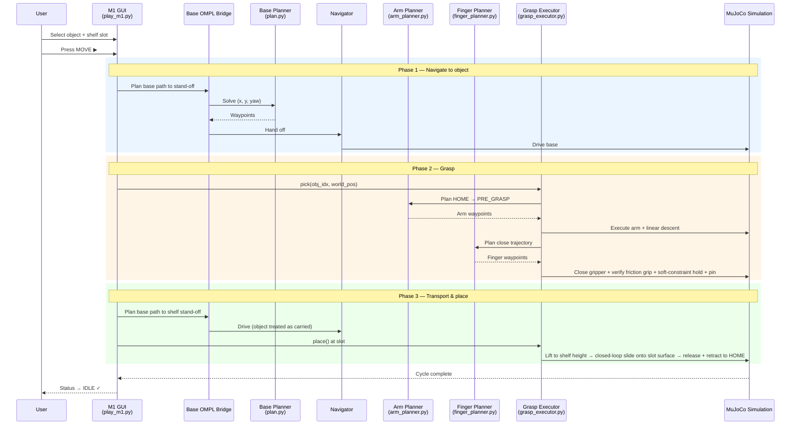

<h1 align="center">M1 OMPL Pick &amp; Place</h1>

<p align="center">
  <strong>End-to-end autonomous pick &amp; place for the MORPH-I mobile manipulator using OMPL motion planning in MuJoCo.</strong>
</p>

<p align="center">
  
  
  
  
  
</p>

https://github.com/user-attachments/assets/7697af3e-2ede-4206-9fe3-4ccee74171d1

<p align="center"><em>▶ Full GUI walkthrough — object selection, MOVE button, OMPL base navigation, OMPL arm grasp, and shelf-side delivery.</em></p>

---

## ✨ Highlights

<table>
  <tr>
    <td align="center" width="33%">
      <strong>🚙 Base — OMPL planned</strong><br><br>
      <sub>RRT-based collision-free <code>(x, y, yaw)</code> path planning for the mecanum mobile base, with validated stand-off candidates next to the target object.</sub>
    </td>
    <td align="center" width="33%">
      <strong>🦾 Arm pickup — OMPL planned</strong><br><br>
      <sub>8-DOF parallel-manipulator planner (<code>H1, H2, A1, TH</code> + <code>HandBearing, gripper_z/x/y_rotation</code>) with per-state MuJoCo collision checks. Solves the <code>HOME → pre-grasp</code> approach, the wrist orientation, and the transport paths together — the pickup motion itself is <em>planned</em>, not scripted.</sub>
    </td>
    <td align="center" width="33%">
      <strong>✊ Fingers — OMPL planned</strong><br><br>
      <sub>RRT-Connect over the 11-DOF gripper joint space. Open and close trajectories that wrap the gripper around the object are produced by the planner — <em>not</em> configured by hand.</sub>
    </td>
  </tr>
</table>

> **Every motion stage is motion-planned.** Base navigation, arm pickup, and finger open/close are each solved by OMPL with their own collision-aware state space. No stage is hand-tuned, scripted, or manually configured.

> **One press, full cycle.** Pick an object → pick a shelf slot → press **MOVE**. The robot drives to the object, the arm plans and executes a real grasp (the gripper visibly closes around the object), the held object is transported to the assigned shelf, **placed onto the slot surface**, and the arm returns to `HOME`.

> **Finest actuator first — whole-body motion economy.** The robot reaches and aligns with the **least-disruptive joint that can do the job**, in priority order: the **wrist** for fine gripper alignment, then the **arm** (columns, extension, base-yaw) for reach and approach, and the **mobile base** only when neither can close the gap. It doesn't drive the whole chassis when a wrist or arm motion suffices — the same whole-body-motion economy a real mobile manipulator relies on to stay precise and avoid unnecessary base travel.

> **Closed-loop, not blind.** The robot doesn't replay a fixed trajectory — it **measures the real physics and corrects**: the grip is confirmed by **measured per-finger contact forces**, the on-shelf placement runs a **position-feedback servo** against the slot target, and a missed reach triggers a **closed-loop base correction** computed from the measured residual. Together with the IK calibration that pre-corrects each target, the system stays accurate against a compliant arm and live contact dynamics instead of assuming an idealized model.

> **Predictable, honest failure.** The pipeline never forces an unsafe grasp. When a spawn is genuinely boxed in — a corner against the rack, or a floor so crowded that no safe base pose exists even after the relaxed-clearance fallback — it **aborts cleanly with a clear log** rather than looping or executing a risky motion. Failure is bounded and explainable, never a crash.

---

## 📑 Table of Contents

- [Quick Start](#-quick-start)
  - [Option A — Docker (recommended)](#option-a--docker-recommended)
  - [Option B — Native install](#option-b--native-install)
- [Run Your First Pick &amp; Place](#-run-your-first-pick--place)
- [Video Demos](#-video-demos)
- [How It Works](#-how-it-works)
- [Project Layout](#-project-layout)
- [Tools &amp; Calibration](#-tools--calibration)
- [Reference Manual](#-reference-manual)
  - [The Scene](#the-scene)
  - [The Robot — MORPH-I](#the-robot--morph-i)
  - [GUI Panel](#gui-panel)
  - [3D Camera Controls](#3d-camera-controls)
- [Troubleshooting](#-troubleshooting)
- [FAQ](#-faq)
- [Scope &amp; Roadmap](#-scope--roadmap)
- [Acknowledgements](#-acknowledgements)

---

## 🚀 Quick Start

You can run this project two ways. **Docker is recommended** because it bundles every system and Python dependency in a reproducible container — you don't need to install Python, MuJoCo, OMPL, or GLFW on your host.

| Option | When to use it |
| --- | --- |
| 🅰 [Docker](#option-a--docker-recommended) | Fastest setup, works on any modern Linux desktop. Use this unless you have a specific reason not to. |
| 🅱 [Native install](#option-b--native-install) | You already have Python 3.10 and want full control over the environment. |

Both paths launch the same `src/gui/play_m1.py` GUI.

> **Reproducible + scriptable.** Beyond the interactive GUI, the same pipeline runs **headless and scripted** — pass `--auto-move-obj M --auto-move-slot N` (optionally `--auto-move-attempts K`) to run full autonomous pick-&-place cycles without clicking, ideal for batch evaluation or CI. The Docker image pins every system and Python dependency, so a run on one machine reproduces on another.

### Option A — Docker (recommended)

**Host requirements:** Linux with X11, Docker Engine 24+ with Compose, working OpenGL driver.

```bash
# 1. Allow Docker to draw on your X11 display (one-time per login session)
xhost +local:docker

# 2. Build the image (first build is 3-5 min; subsequent builds use cache)
docker compose -f docker/docker-compose.yml build

# 3. Launch the M1 OMPL GUI
docker compose -f docker/docker-compose.yml run --rm motion-planning \
    python3 src/gui/play_m1.py
```

A MuJoCo window opens with the market scene. See [`docker/README.md`](docker/README.md) for X11 permissions, GPU passthrough, UID/GID mapping, and other entry points.

### Option B — Native install

Requires **Ubuntu 22.04** with Python 3.10 and OpenGL libraries.

<details>
<summary><strong>1. System dependencies</strong></summary>

```bash
sudo apt-get update
sudo apt-get install -y python3.10 python3.10-venv python3-pip \
    libgl1 libglfw3 libglew2.2 libosmesa6 ffmpeg
```

> **Why Python 3.10?** The OMPL planning library is distributed as a Python wheel compiled for specific Python versions. Python 3.10 matches the available OMPL wheel.
</details>

<details>
<summary><strong>2. Create virtual environment</strong></summary>

```bash
cd motion-planning
python3.10 -m venv .venv
.venv/bin/python -m pip install --upgrade pip
.venv/bin/python -m pip install -r requirements.txt
```
</details>

<details>
<summary><strong>3. Verify installation</strong></summary>

```bash
PYTHONPATH=src .venv/bin/python tools/smoke_test.py
```

You should see `[OK]` for each import (mujoco, glfw, imgui, numpy, ompl) and a successful XML load message.
</details>

<details>
<summary><strong>4. Launch the GUI</strong></summary>

```bash
OMPL_BRIDGE_MODE=native PYTHONPATH=src .venv/bin/python src/gui/play_m1.py
```

A window opens showing the market-world scene with the robot and scattered objects.
</details>

### Run modes

The GUI launches in the default grip mode unless overridden. Two physics profiles are available:

| Mode | How to launch | Description |
| --- | --- | --- |
| **Default** *(recommended)* | `python src/gui/play_m1.py` | Friction-based grip — the pipeline **first runs a real close stroke and verifies the grip via measured per-finger contact forces**, **then** adds a compliant soft constraint **purely to suppress two known properties of MuJoCo's rigid-body contact solver** that bite during high-acceleration transport: (a) contact-force chatter (forces oscillating between near-zero and multi-kN within milliseconds), and (b) the small friction-slip at force troughs. The soft constraint is **not** holding the object — the fingers are; it is the standard pattern the reference documentation provided at project start prescribes. It is **not** a fake or teleporting grip — without a passed verify gate it never engages. Robust across the full object size range; what the end-to-end demo videos show. |
| **`--perfect`** | `python src/gui/play_m1.py --perfect` | **Same close stroke and verify gate as the default mode** — the difference is what happens after verify passes: no soft constraint at any phase, the object is held purely by Coulomb friction between finger pads and surface for the full lift / carry / drop, exactly the way a real 3-finger gripper holds an object. Lower per-cycle reliability than the default — **bounded by MuJoCo's contact-solver ceiling for the 1+2 asymmetric gripper on a flat-pad-on-cylinder line contact**, not by remaining tuning headroom. Available for use cases that require purely contact-driven behaviour. |

> Both modes use the same OMPL planning stack and GUI controls. The flag only switches the contact / actuator parameters at simulator load time. The default mode's soft constraint activates **after** the close stroke + verify gate confirm a balanced multi-finger grip — matching the recommended pattern for MuJoCo manipulation pipelines — not as a replacement for the physical grip.
>
> 📄 **Deep dive on the grip physics.** For the full engineering record — what was tried, what worked, why the soft-constraint sequence above is the standard pattern, and where MuJoCo's contact-solver ceiling sits for this gripper-and-object pair — see [`FRICTION_PICKUP_REPORT.md`](FRICTION_PICKUP_REPORT.md). Covers 130+ parameter values tested across 4 campaign phases and 800+ simulation runs.

---

## 🎯 Run Your First Pick & Place

Once the GUI is open, follow this exact sequence to see the autonomous cycle end-to-end:

| # | Action | What you should see |
| :-: | --- | --- |
| **1** | **Launch** the GUI (Docker or native command from above) | Market-world scene loads, GUI panel appears in the top-left corner |
| **2** | **Look around** with the camera (left-click drag, scroll to zoom) | Numbered colored circles floating above each object and shelf slot |
| **3** | **Select object** — open the `Object ID` dropdown under PICK & PLACE | Selected object lights up yellow with a ring around its marker |
| **4** | **Select shelf slot** — open the `Shelf Slot ID` dropdown | Slot ring lights up green — this is the delivery target |
| **5** | **Press `MOVE ▶`** (the green button) | Button turns yellow ("Moving…"); terminal prints `[OMPL]` planning logs |
| **6** | **Watch the cycle** | Status walks through `● Navigating…` → `● Grasping…` → `● Holding Obj-X` → `● Delivering…` |
| **7** | **Cycle complete** | Object placed onto the assigned slot surface; arm retracts to `HOME`; status returns to `IDLE` |
| **8** | **Try again** — click `Respawn Objects`, pick a new (object, slot), press MOVE | Layout randomizes; whole cycle repeats |

> 💡 **Tip:** Keep the camera stable during the cycle so you can watch the planned base path and the arm descent clearly.

---

## 🎥 Video Demos

### Perspective view (GUI)

https://github.com/user-attachments/assets/695057d8-ac5d-4d04-b23c-6d7fcb487292

*Full recording: navigate, grasp, transport, deliver.*

### Step-by-step preview

| Step | Preview | What to look for |
| --- | --- | --- |
| **1. Select object & slot** |  | Object highlighted yellow, slot ring green, dropdowns visible in the PICK & PLACE panel. |
| **2. Navigate** |  | Base drives along the OMPL path to a validated stand-off pose next to the object. Status: `MOVING`. |
| **3. Grasp & deliver** |  | ARM1 follows its OMPL-planned approach, the OMPL-planned finger trajectory closes the gripper around the object (`● Holding Obj-X`), then the base drives to the shelf-side aisle to release. |

---

## 🧠 How It Works

### Pipeline overview



### Component responsibilities

| Module | Role |
| --- | --- |
| `gui/play_m1.py` | GUI orchestrator. User input, scene rendering, candidate stand-off validation, full pipeline coordination. |
| `navigation/plan.py` | Base OMPL planner. Builds the `(x, y, yaw)` collision-aware search space; returns base waypoints. |
| `navigation/ompl_windows_bridge.py` | Base-planner bridge. Native Linux mode + a remote-WSL mode (`OMPL_BRIDGE_MODE` env var). |
| `navigation/ompl_navigator.py` | Base waypoint follower. Drives the mecanum base along the planned path; reports progress. |
| `navigation/arm_planner.py` | **8-DOF arm OMPL planner** (`MORPHBridge`) — 4 arm slides (`H1, H2, A1, TH`) plus 4 wrist orientation joints (`HandBearing, gripper_z/x/y_rotation`). Per-state MuJoCo collision checks; `plan(start_q, goal_q)` and `solve_ik(world_pos, wrist_goal=…)` produce the pickup approach trajectory and the gripper orientation together — both are solved by the planner, not authored by hand. |
| `navigation/finger_planner.py` | **Gripper finger OMPL planner** (`FingerBridge`). RRT-Connect over the 11-DOF gripper joint space; the open- and close-around-object trajectories are produced by the planner instead of being configured manually. |
| `navigation/grasp_executor.py` | Pick & place orchestrator. Sequences open → OMPL approach → linear descent → close + friction verify → soft-constraint hold + pin → OMPL transport → **lift-to-shelf-height + closed-loop slide onto the slot surface** → release → OMPL retract. |

> 🧩 **Carried-object handling.** The object is held by **friction between the gripper pads and the object surface** — the same mechanism a real 3-finger gripper uses. The default pipeline **first establishes a real physical grip** (close stroke + measured-force verify gate) **and only then** adds a compliant soft constraint, **purely to suppress MuJoCo's contact-solver chatter and friction-slip during transport** — the soft constraint is not holding the object, the fingers are. Adding it lets the arm planner treat the carried object as part of the robot during collision checks. This sequence — verify the physical grip first, then add the transport-stability constraint — is the standard pattern the reference documentation provided at project start prescribes; it is **not** a fake or teleporting grip (the constraint never fires without a passed verify gate). The `--perfect` mode runs the same close stroke and verify gate, then disables the constraint entirely and lifts on pure Coulomb friction end-to-end.
>
> 🔍 **About the small finger-into-object penetration you'll see.** MuJoCo simulates contact with a **soft-contact band** (a few millimetres of allowed interpenetration where the contact force ramps up smoothly). **Think of it as a real rubber gripper pad compressing fractions of a millimetre under contact pressure — the simulator's soft band represents the same physical compliance.** This is the standard and recommended setup for grip simulation — a perfectly hard contact would produce numerical instability, judder, and the object would slip out of the fingers. The visible sub-centimetre dip of the pads into the object surface is the gripper sitting at the equilibrium point of that soft-contact band, which is where stable normal force (and therefore friction) is generated. It is a feature of the physics model, not a bug in the grasp — and it is present in both run modes for exactly the same reason.
>
> 🎯 **First-attempt accuracy — the IK calibration table (one of the highest-leverage pieces of the pipeline).** The parallel manipulator's columns deflect under load, so a pure-kinematic IK pose settles off the commanded one — up to a few centimetres at the reach extremes, which on a single-shot grasp is the difference between a clean pick and a miss. Before planning each grasp, the arm planner reads a **pre-computed calibration table (LUT)** — `data/arm_calibration_*.npz`, generated once by [`tools/calibrate_arm_kinematics.py`](tools/calibrate_arm_kinematics.py) — that maps every arm configuration to its measured settling deflection, and **pre-corrects the IK target** before the planner runs. The insight: this deflection is **systematic and pose-dependent**, so rather than fight it online every cycle, the system measures it **once** and the planner simply subtracts it — turning a compliant, hard-to-control arm into one that **lands the grasp accurately on the first attempt across the full reach range, with no per-object tuning**. The tables ship in `data/`, so the system is accurate **out of the box**; you only regenerate them if the arm geometry changes (see [Tools & Calibration](#-tools--calibration)).
>
> 📥 **Precise on-shelf placement.** Delivery is not a blind open-over-the-slot. After transport, a **closed-loop placement servo** first lifts the held object to the target shelf height, then slides it horizontally onto the assigned slot surface — measuring the object's actual position against the slot target on every step and correcting until it is seated. The same lift-then-slide logic serves the low, mid, and high shelf tiers, and the placement falls back gracefully (a clean, logged outcome) if a slot is genuinely out of reach rather than forcing an unsafe move.

---

## 📁 Project Layout

```
motion-planning/
├── README.md                       # this file
├── FRICTION_PICKUP_REPORT.md       # engineering report on the grasp/lift tuning campaign
├── play.py                         # one-line entry script → wraps src/gui/play_m1.py with defaults
├── requirements.txt                # Python deps (native install)
├── docker/                         # reproducible Docker setup → docker/README.md
├── assets/                         # GUI screenshots and demo videos
├── ROS/                            # placeholder for future ROS integration
├── tools/
│   ├── smoke_test.py                   # imports + XML load sanity check
│   ├── calibrate_arm_kinematics.py     # regenerate the top-down arm IK calibration LUT
│   ├── build_reachability_lut.py       # build the reachability LUT for arm-led fine alignment
│   ├── measure_gripper_aperture.py     # measure gripper aperture; validate object radius range
│   ├── inspect_collisions.py           # OMPL obstacle rects vs MuJoCo collision geometry
│   ├── m2_view_scene.py                # inspect the M2 placement scene (shelves + slot layout)
│   ├── sweep_m2_placements.py          # batch test of placement candidates across all slots
│   └── sweep_slot_reachability.py      # reachability check across all shelf slots
├── data/
│   ├── arm_calibration.npz                  # top-down arm IK calibration LUT
│   ├── arm_calibration_sidegrip.npz         # side-grip arm IK calibration LUT
│   ├── arm_calibration_sidegrip_5d.npz      # 5-DOF side-grip variant LUT
│   ├── arm_calibration_sidegrip_dynamic.npz # dynamic-load-compensated side-grip LUT
│   └── arm_reachability_sidegrip.npz        # reachability LUT for arm-led fine alignment
└── src/
    ├── gui/
    │   ├── play_m1.py              # main GUI / pipeline orchestrator
    │   └── screen_recorder.py      # screen-capture helper for demo videos
    ├── navigation/
    │   ├── plan.py                 # base OMPL planner
    │   ├── ompl_windows_bridge.py  # OMPL native + WSL bridge
    │   ├── ompl_navigator.py       # base waypoint follower
    │   ├── arm_planner.py          # 8-DOF arm + wrist OMPL planner
    │   ├── finger_planner.py       # gripper finger OMPL planner
    │   ├── grasp_controller.py     # low-level grasp control (close / verify / release)
    │   └── grasp_executor.py       # pick & place orchestrator (M1 pickup + M2 placement)
    ├── simulations/
    │   └── morph_i_free_move.py    # core MORPH-I simulation engine
    └── env/
        ├── market_world_m1.xml         # MuJoCo scene (objects + shelves, M1 pickup)
        ├── m2_environment_shelves.xml  # M2 placement scene (shelf slots)
        ├── env_assets.xml              # shared environment assets include
        └── robot/
            └── obotx_V2_OBJs.xml       # MORPH-I robot model (8-DOF arm + 1+2 DELTO gripper)
```

---

## 🧰 Tools & Calibration

A small set of purpose-built tools live under [`tools/`](tools/). They are independent of the GUI and used either during setup or whenever the robot / gripper geometry changes.

| Tool | What it does | When to run it |
| --- | --- | --- |
| **`calibrate_arm_kinematics.py`** | Sweeps the arm joint grid in simulation and measures the chassis-relative deflection between the pure-kinematic IK pose and the post-physics settled pose (caused by the parallel manipulator's passive `RotationLeftJoint`). Writes the result to `data/arm_calibration_<mode>.npz`. The arm planner loads this LUT at startup and uses it to pre-correct IK targets before planning. | After any change to the arm XML, link inertias, or wrist orientation modes. The default LUTs ship in `data/` so the GUI works out of the box. |
| **`measure_gripper_aperture.py`** | Parks the robot and steps the finger actuators across the full close stroke, recording the thumb-tip ↔ side-finger-pair span at each step. Derives the band of object radii that the gripper can wrap with a productive 3-point pinch (positive closure margin, no interpenetration). | When changing the gripper, finger links, or before introducing new object sizes — to confirm the chosen `OBJ_RADIUS_RANGE` is geometrically reachable. |
| **`inspect_collisions.py`** | Prints world-axis-aligned bounding boxes for the rack, walls, chassis, and key bodies, then compares them against the 2-D obstacle rectangles the OMPL base planner uses (`navigation/plan.py:OBSTACLE_RECTS`). Flags rack-graze / overhang mismatches between the planner's world model and MuJoCo's collision geometry. | When the planner accepts a path that MuJoCo then rejects, or after editing the scene XML / `OBSTACLE_RECTS`. |
| **`smoke_test.py`** | Imports every runtime dependency (`mujoco`, `glfw`, `imgui`, `ompl`, etc.) and loads the scene XML. | After a fresh install — confirms the environment is healthy before launching the GUI. |

Run any tool from the project root:

```bash
PYTHONPATH=src .venv/bin/python tools/<tool_name>.py
```

**Regenerating the IK calibration LUT** (only needed if you change the arm geometry — the default tables already ship in `data/`):

```bash
# Calibrate for the default side-grip pickup wrist mode
PYTHONPATH=src .venv/bin/python tools/calibrate_arm_kinematics.py --wrist-mode sidegrip
# → writes data/arm_calibration_sidegrip.npz, which the arm planner loads at startup

# Other options: --wrist-mode {sidegrip,topdown,…}   --out <path>   --xml <world.xml>
```

(or the equivalent `docker compose ... run --rm motion-planning python3 tools/<tool_name>.py` from the Docker setup.)

---

## 📖 Reference Manual

### The Scene

The simulation launches into a **market-world environment** containing:

- **The MORPH-I robot** — 4-wheeled mobile base + dual parallel-manipulator arms + 3-finger grippers.
- **10 pickup objects** — randomly placed product items on the floor; each has a unique color and numbered label.
- **10 shelf slots** — three height tiers (low / mid / high). The selected slot is the delivery target.
- **Numbered markers** — small colored rings floating above each object and slot for easy identification.

> The selected object glows yellow; the selected shelf slot ring is green.

### The Robot — MORPH-I

A 4-wheeled omnidirectional mobile base carrying dual independent parallel manipulators.

| Component | Description |
| --- | --- |
| **Mobile Base** | 4-wheel omnidirectional (mecanum) drive — moves in any direction without turning first. |
| **Left Arm (ARM1)** | Parallel manipulator: 2 prismatic columns (`H1`, `H2`), 1 horizontal extension (`A1`), 1 revolute base joint (`TH`), plus 4 wrist orientation joints (`HandBearing`, `gripper_z/x/y_rotation`). |
| **Right Arm (ARM2)** | Same configuration as ARM1, independently controlled. |
| **Grippers** | Two 3-finger **DELTO M3** grippers (one per arm) — *1 thumb opposed to 2 side fingers* (asymmetric, not 3 symmetric fingers). The OMPL finger planner accounts for this 1+2 geometry when producing the close trajectory. Each gripper is controllable from 0 % open to 100 % closed. |

#### Joint configuration

| Joint | Type | Range | Function |
| --- | --- | --- | --- |
| `H1` | Prismatic | 0 – 1.5 m | Height of left vertical column |
| `H2` | Prismatic | 0 – 1.5 m | Height of right vertical column |
| `A1` | Prismatic | 0 – 0.7 m | Horizontal arm extension |
| `TH` | Revolute | ±180° | Yaw rotation of entire arm assembly |
| `HandBearing` | Revolute | ±90° | Wrist pitch — tilts the gripper between top-down and side-grip orientations |
| `gripper_z_rotation` | Revolute | ±180° | Palm roll about the wrist axis |
| `gripper_x_rotation` | Revolute | ±46° | Wrist X tilt — fine alignment with object orientation |
| `gripper_y_rotation` | Revolute | ±46° | Wrist Y tilt — fine alignment with object orientation |

> **Note:** For the autonomous cycle, only **ARM1** is driven by the planner; **ARM2** is parked at a safe pose. Both arms remain available for manual control via the GUI sliders.

### GUI Panel

The GUI panel appears on the **top-left corner** of the window. From top to bottom:

<p align="center">
  
</p>

#### 1. PICK & PLACE *(main workflow)*

<p align="center">
  
</p>

| Element | What it does |
| --- | --- |
| **Object ID** dropdown | Choose the target object. Each entry shows a name (e.g., `Obj-4 [Nestle Candy]`) and color swatch; the object's 3D position is shown below. |
| **Shelf Slot ID** dropdown | Choose the destination slot. Entries show row category (low/mid/high) and Z. The robot delivers to this slot's aisle column. |
| **MOVE ▶** | **Press to start the autonomous cycle.** Navigate → grasp → transport → release. Button turns yellow ("Moving…") during navigation. |
| **Status text** | Live state below the button: `● Navigating…` (yellow) / `● Grasping…` (orange) / `● Holding Obj-X` (green) / `● Delivering…` / last result. |
| **Cancel** | Appears during navigation. Stops the robot immediately and aborts the cycle. |
| **Release** | Appears while holding an object. Releases it where the gripper currently is. |

#### 2. Robot Arms

<p align="center">
  
</p>

Sliders for **ARM1** (left) and **ARM2** (right):

| Mode | Controls | Description |
| --- | --- | --- |
| **IK Control** ☑ | `X`, `Y`, `Z` per arm | Move the gripper tip to a 3D target — IK solver computes the joint angles. |
| **IK Control** ☐ | `H1`, `H2`, `A1`, `TH` per arm | Direct joint control: `H1`/`H2` = column heights, `A1` = horizontal extension, `TH` = base rotation. |

> Manual arm control is for inspection / testing — not required for the autonomous cycle.

#### 3. Grippers

<p align="center">
  
</p>

| Control | Description |
| --- | --- |
| **Left** slider (0 %–100 %) | Left gripper: 0 % = fully open, 100 % = fully closed. |
| **Right** slider (0 %–100 %) | Right gripper: 0 % = fully open, 100 % = fully closed. |

#### 4. Simulation Controls

<p align="center">
  
</p>

| Button / Checkbox | What it does |
| --- | --- |
| **Pause** | Freezes MuJoCo physics. GUI stays interactive. Uncheck to resume. |
| **Reset Robot** | Returns the robot to its starting pose; cancels any active cycle. |
| **Respawn Objects** | Randomizes positions and sizes of all 10 pickup objects. |

#### 5. Joystick

<p align="center">
  
</p>

| Area | How to use | Effect |
| --- | --- | --- |
| **Inner circle** | Drag inside the small circle | Translate the base (forward / back / sideways). |
| **Outer ring** | Drag on the ring edge | Rotate the base (yaw). |
| **Orange dot** | (automatic) | Shows the base's current heading. |

Below the joystick: live base pose, e.g. `Base → X:3.16 Y:-5.51 Yaw:90.0°`.

> Joystick is for **manual repositioning only**. Use `MOVE ▶` for the autonomous cycle.

#### 6. Bottom Status Bar

<p align="center">
  
</p>

- **Left:** selected object name + color (e.g. `Object: Obj-4 [Nestle Candy]`).
- **Center:** selected shelf slot (e.g. `Shelf: Slot-3 [row=low z=0.50m]`).
- **Right:** robot state — `IDLE` (green) / `● MOVING` (yellow) / `● GRASPING` (orange) / `● HOLDING` (green).

### 3D Camera Controls

| Action | Mouse |
| --- | --- |
| **Rotate** view | Left-click + drag |
| **Pan** view | Right-click + drag |
| **Zoom** | Scroll wheel, or middle-click + drag |

#### Geom group toggles (number keys)

MuJoCo's number keys toggle geom-group visibility — useful for inspecting what the planner reasons about:

| Key | Shows |
| --- | --- |
| `0` | Visible meshes (default scene) |
| `2` | Decorative arm meshes |
| **`3`** | **Arm collision overlay** — translucent green box(es) showing the simplified shape OMPL uses to validate arm states. Useful for debugging rejected pre-grasp poses. |
| `4` | Wheel/base collision proxies (off by default) |

---

## 🛠 Troubleshooting

### Native install

| Symptom | Cause | Fix |
| --- | --- | --- |
| `python3.10: command not found` | Python 3.10 not installed | `sudo apt install python3.10 python3.10-venv` |
| `.venv/bin/python: not found` | Virtual environment not created | Re-run the setup commands from the repo root |
| `ModuleNotFoundError` for any package | Dependencies missing | `.venv/bin/python -m pip install -r requirements.txt` |
| `import ompl` fails in smoke test | OMPL wheel incompatible with your Python | Use Python 3.10 and recreate `.venv` from scratch |

### Docker

| Symptom | Cause | Fix |
| --- | --- | --- |
| `cannot connect to X server` | Container has no permission to draw on host display | `xhost +local:docker` on the host before launching |
| "Application Not Responding" popup at startup | Heavy initialization (MuJoCo + OMPL collision table) blocks the event loop briefly | Click **Wait** once or twice — harmless, only on startup |
| Permission errors on bind-mounted files | Container UID/GID ≠ host | Copy `docker/env.example` → `docker/.env`, set `USER_UID`/`USER_GID` to your `id -u`/`id -g`, rebuild |
| GUI runs in software OpenGL (slow) | `/dev/dri` not exposed or no GPU driver on host | Verify `ls /dev/dri` and `glxinfo \| grep renderer` — see [`docker/README.md`](docker/README.md) |

### Runtime

| Symptom | Cause | Fix |
| --- | --- | --- |
| GUI window does not open | No display server / missing OpenGL | Run from a desktop session (not SSH). `sudo apt install libgl1 libglfw3` |
| GUI does not open in WSL2 | WSL GUI support not configured | Use Windows 11 with WSLg, or configure an X server |
| `MOVE` does nothing | OMPL unavailable or planning failed | Run the smoke test. Check terminal for `[OMPL]` errors |
| Robot does not move after pressing MOVE | Target unreachable from current pose | Click `Respawn Objects` and try again |
| Grasp fails / object slips | Object too close to chassis or pre-grasp pose rejected by arm collision check | The GUI auto-tries the next stand-off candidate; if all fail, `Respawn Objects` |

---

## ❓ FAQ

### Are valid arm/finger states pre-computed and stored, or sampled at runtime?

Sampled at runtime, using **RRT-Connect** with MuJoCo as the state validity checker. The combined arm + gripper configuration space is 19-dimensional (8-DOF arm + 11-DOF gripper) — too large to enumerate exhaustively. For each plan call:

1. The planner samples joint configurations on demand from the OMPL state space.
2. Each sample is validated by writing it to `data.qpos`, calling `mj_forward`, and inspecting `data.ncon` for prohibited contacts.
3. A custom validity layer allows expected contacts (gripper–object during the carry phase) while rejecting prohibited ones (robot self-collision, arm vs. shelf, etc.).

Typical planning times: ~50–500 ms per arm plan, ~50–200 ms per finger plan.

A discretized valid-state **planning** library — coarse offline pre-sampling of planner configurations followed by runtime filtering — is a valid additive optimization for use cases that need very fast planning across many objects in sequence. It can sit on top of the existing pipeline as a warm-start cache without restructuring anything.

> **Distinct from the IK calibration LUT.** The planning-state cache above is a *future optional* speed-up and is **not** used — planning states are sampled fresh at runtime, as described. The system **does**, however, load one small pre-computed table at startup: the **IK calibration LUT** (`data/arm_calibration_*.npz`). That table stores the parallel arm's per-configuration settling deflection so the planner can **pre-correct each IK target** before solving — a calibration table, *not* a library of planning states. (See *🎯 First-attempt accuracy* under **How It Works**.)

### Can the available states be visualized?

The full configuration space is continuous and 19-dimensional, so it cannot be enumerated visually as a whole. Several useful subsets can be visualized as debug add-ons:

- **RRT tree from a single planning run** — the actual states the planner explored to reach a goal. Most useful for understanding why a particular plan succeeded or failed.
- **Coarse joint-space sweep of the 8-DOF arm** — at 10° per joint, ~10⁹ samples, too dense to render fully but per-DOF projections are manageable as reachable-pose clouds.
- **Workspace reachability map** — the Cartesian volume the gripper can reach, sampled across joint configurations. Standard tool for confirming arm reach.

These are straightforward to add as a separate visualization module on top of the existing planner.

### What is the typical pick success rate?

In testing across randomized spawn layouts, roughly **70–80 % of pick attempts complete on the first 1–2 base-pose candidates**, and the **end-to-end success rate with the full retry chain enabled is around 90 %**. The remaining ~10 % are spawn configurations where the object lands in a tight corner against the rack or in a corridor that genuinely cannot be navigated even after the relaxed-clearance fallback — in those cases the pipeline aborts cleanly with a "no feasible candidate" log instead of executing an unsafe grasp.

Residual failures are typically a function of spawn geometry rather than the planner: the object lands in a tight corner against the rack/keepout zones, or the chassis-clearance check refuses every base candidate because the floor is crowded with other objects. The relaxed-clearance fallback (see retry strategy) handles most of the crowded-floor case; the genuinely unreachable spawns abort cleanly with a "no feasible candidate" log instead of executing an unsafe grasp.

You may sometimes see the **first grasp attempt show a larger-than-expected gripper-to-object distance** before the system retries. This is the pre-close gate firing — not a bad grasp executing. The parallel manipulator has a passive `RotationLeftJoint` that deflects under load, so a naive static-model IK would under-predict the runtime pose by a few centimetres, especially at low column heights. **The IK calibration LUT is built precisely to remove this** — it pre-shifts each IK target by the measured per-configuration deflection, so the planned grasp lands accurately. At the most extreme (lowest-column) poses a small residual can remain beyond what the table captures; the pre-close gate catches that residual and a closed-loop base correction cleans it up before the next attempt.

### How does the retry strategy work?

Layered, in order from cheapest (finest actuator, no base motion) to most expensive (whole re-navigation) — the same **finest-actuator-first** priority the system applies everywhere:

1. **Arm-only in-place re-attempt** — the first and cheapest correction: the arm re-attempts the grasp from its current pose **without moving the base at all**, keeping the correction on the arm before the chassis is asked to do anything (one re-attempt per stand-off candidate).
2. **Closed-loop base correction** — if the arm alone can't close the gap, the executor reports the residual XY error between the gripper and the IK target, and the base translates by exactly that error vector (yaw held fixed); the close is retried, up to **5 attempts per cycle** (3 in `--perfect`). Because the arm pose is rigid in the base frame and yaw is locked, translating the base by the residual translates the gripper by the same amount — the closed-loop converges quickly when the IK error is geometric.
3. **Next pre-screened candidate** — the system generates up to **5 base-pose candidates** ranked by arm-quality score (tilt, reach) and palm-orientation alignment. If candidate 1 fails, candidate 2 is tried, etc. — each with a fresh OMPL plan from the current arm/base state.
4. **Re-scan from the current pose** — if all initial candidates fail, candidate generation is re-run from the current robot position rather than the original starting pose, which often yields a different valid set.
5. **Relaxed-clearance navigation fallback** — if every candidate has been refused by the strict floor-object clearance check (dense object spawns can box the robot in), the validator switches to a relaxed mode that exempts all non-selected floor objects. **The selected pick target stays protected, and rack/walls remain hard obstacles** in both modes — only the chassis-vs-other-floor-object distance check is relaxed. The system retries the same candidates with the loosened clearance.

After the retry chain is exhausted, the pick is abandoned with a clear log instead of looping forever.

### Why does replanning from the current state often succeed where the previous attempt failed?

Two reasons:

- **Different geometry per candidate.** Each base candidate has a different yaw and a different IK solution, so runtime tracking error on this parallel manipulator depends on the specific joint configuration. A different geometric pose can track substantially better because the passive joints carry less load at that configuration.
- **Live state, not stale plan.** The replan is computed from the current physical robot state after retract, not the original idealized starting pose. PD control has settled, the arm's actual kinematic state matches what the new plan assumes, and tracking is cleaner.

When none of the candidates work, the system aborts honestly rather than spinning.

---

## 🗺 Scope & Roadmap

| Feature | Status |
| --- | --- |
| M1 market-world scene loading | ✅ Implemented |
| Object labels and colored markers in 3D | ✅ Implemented |
| Object selection via GUI dropdown | ✅ Implemented |
| Shelf slot selection (delivery target) | ✅ Implemented |
| OMPL collision-aware base path planning | ✅ Implemented |
| Waypoint-following base navigation | ✅ Implemented |
| OMPL 8-DOF arm + wrist planning (grasp + transport) | ✅ Implemented |
| OMPL gripper finger planning (open / close) | ✅ Implemented |
| Autonomous grasp with verified friction grip (soft-constraint transport hold) | ✅ Implemented |
| Autonomous shelf-side delivery onto the assigned slot | ✅ Implemented |
| Manual arm / gripper control via GUI | ✅ Implemented |
| Manual base control via joystick | ✅ Implemented |
| Precise on-shelf placement onto the slot surface | ✅ Implemented |
| ROS 2 / MoveIt2 integration | ❌ Out of scope for this repository |

> **Solid foundation, ongoing refinement.** Every stage above runs end-to-end today, on a complete pipeline — OMPL planning, IK calibration, verified grip, and closed-loop correction. Accuracy on the hardest cases (the tightest spawn corners and the most extreme reach poses on the compliant arm) keeps improving through additional per-configuration calibration and parameter tuning on top of that foundation — incremental refinement, the normal path from a working system to a hardened one.

> **What is OMPL?** *Open Motion Planning Library* — a widely-used open-source library for computing collision-free paths for robots. This project uses OMPL at three levels: the mobile base, the 8-DOF arm + wrist, and the gripper fingers — each with its own collision-aware state space.

---

## 🙏 Acknowledgements

This project builds on excellent open-source MuJoCo work:

- 🍳 **Kitchen assets** — [furniture_sim by vikashplus](https://github.com/vikashplus/furniture_sim)
- 🛒 **Market product assets** — [Scanned Objects MuJoCo Models by kevinzakka](https://github.com/kevinzakka/mujoco_scanned_objects)
- 🛞 **Mecanum mobile base** — [Mecanum Drive in MuJoCo by JunHeonYoon](https://github.com/JunHeonYoon/mujoco_mecanum)
- ✋ **3-finger gripper** — [DELTO_M_ROS2 by tesollodelto](https://github.com/tesollodelto/delto_m_ros2/tree/jazzy-dev)
