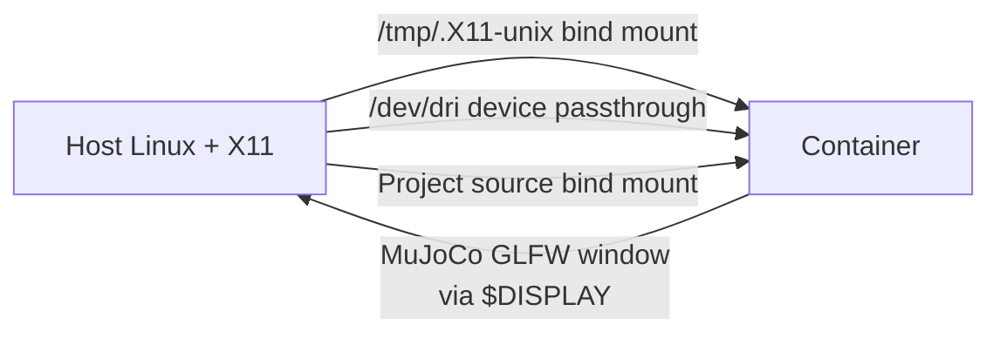

# Docker Setup — MORPH Motion Planning (M1 OMPL Pick-and-Place)

This folder contains everything needed to build and run the
`motion-planning` project inside a reproducible Docker environment.
You do **not** need to install Python, MuJoCo, OMPL, or GLFW on your
host system; everything is bundled in the container image.

The only host requirements are:

- Linux with an X11 display server (the container streams MuJoCo's
  GLFW window to your host's X server)
- Docker Engine 24+ with the Docker Compose plugin
- A working OpenGL driver on the host (for hardware-accelerated rendering)

> Tested on Ubuntu 22.04 with Docker Engine 27.x. Should work on most
> modern Linux distributions; macOS and Windows require additional X11
> setup that is outside the scope of this guide.

---

## Contents

| File | Purpose |
| --- | --- |
| `Dockerfile` | Ubuntu 22.04 image with Python 3 + MuJoCo + OMPL + GLFW |
| `docker-compose.yml` | Service definition for `motion-planning`, including X11 forwarding and GPU device passthrough |
| `env.example` | Template for `.env`; copy to `.env` to override defaults |
| `.dockerignore` | Files excluded from the image build context |

The container's Python dependencies are read from the **single project-root
`requirements.txt`** (at `motion-planning/requirements.txt`), not a separate
Docker-only file. This keeps one dependency source of truth shared between
the Docker and native installs — no risk of drift when packages are updated.

---

## Quick Start

All commands below are run **from the `motion-planning/` project root**
(i.e. the directory that contains `src/`, `docker/`, `README.md`, etc.).

### 1. Allow Docker to use your host's X11 display

This is a one-time grant per host login session. It lets the container's
GUI applications draw windows on your screen:

```bash
xhost +local:docker
```

When you are done, you can revoke the grant with:

```bash
xhost -local:docker
```

### 2. Build the image

```bash
docker compose -f docker/docker-compose.yml build
```

This downloads Ubuntu 22.04, installs system + Python dependencies,
and copies the project source into the image. The first build takes
3-5 minutes depending on your network. Subsequent builds use Docker's
layer cache and are much faster.

### 3. Run the M1 OMPL pick-and-place GUI

```bash
docker compose -f docker/docker-compose.yml run --rm motion-planning \
    python3 src/gui/play_m1.py
```

A MuJoCo window should open on your host displaying the robot in the
shop scene. Use the on-screen controls to select an object and a shelf
slot, then click **MOVE**.

> If the window appears blank or the program errors with
> `cannot connect to X server`, see the **Troubleshooting** section below.

### 4. Stop / clean up

`docker compose run --rm` cleans up the container automatically when
the GUI is closed. To remove the built image entirely:

```bash
docker compose -f docker/docker-compose.yml down
docker rmi morph-motion-planning:ubuntu22.04
```

---

## How the Container is Wired



- **Source code is bind-mounted** at `/workspace`. Edits you make on the
  host show up immediately inside the container; no rebuild needed
  unless you change `requirements.txt` or system packages.
- **X11 socket** is bind-mounted from `/tmp/.X11-unix` so the
  container's GLFW windows render on your host display.
- **GPU device** `/dev/dri` is passed through for hardware-accelerated
  OpenGL inside the container.
- **Networking** uses `network_mode: host` so internal communication
  (e.g. the OMPL bridge) is straightforward.

---

## Troubleshooting

### "cannot connect to X server" / GUI window does not open

You forgot to grant Docker access to your X server. From the host:

```bash
xhost +local:docker
```

Then retry. If the problem persists, verify your `DISPLAY` environment
variable on the host is set (`echo $DISPLAY` should print `:0` or
similar) and that you are running Docker as a regular user (not via
`sudo`, which has a different X11 context).

### "Application Not Responding" popup at startup

This is harmless. The first few seconds of startup do heavy
initialization (loading the MuJoCo scene, building the OMPL collision
table, etc.). Your desktop's window manager momentarily flags the
window as unresponsive. Click **Wait** once or twice — once the main
event loop starts, the dialog goes away and the GUI is fully responsive.

### Permission errors on bind-mounted files

The container runs as user `morph` (UID/GID 1000 by default). If your
host UID/GID is different, copy `env.example` to `.env` and adjust:

```bash
cp docker/env.example docker/.env
# edit USER_UID and USER_GID to match your host
docker compose -f docker/docker-compose.yml build --no-cache
```

Verify your host UID with `id -u` and GID with `id -g`.

### MuJoCo prints `GL renderer  Software` (no GPU acceleration)

Your host's OpenGL driver isn't reaching the container. Most commonly
this means `/dev/dri` is missing on the host, or your host doesn't
have a hardware GL driver installed. Try:

```bash
ls /dev/dri      # should show card0 / renderD128 etc.
glxinfo | grep -i renderer    # should NOT say "llvmpipe" / "Software"
```

If your host runs `llvmpipe`, the container will too. The simulation
will still run but slower.

### NumPy / OMPL import error

The image pins `numpy==1.26.4` deliberately because `ompl==2.0.0`
wheels are compiled against the NumPy 1.x ABI. If you see an error
like `numpy.dtype size changed` after editing `requirements.txt`,
it usually means NumPy was bumped to a 2.x version. Revert that
change and rebuild.

---

## Internal architecture (reference)

If you want to dig deeper, the project's own README at the
`motion-planning/` level documents the application architecture
(OMPL state space, MuJoCo bridge, M1 GUI flow, etc.). This Docker
guide only covers reproducible deployment. The container does not
modify any application logic.
