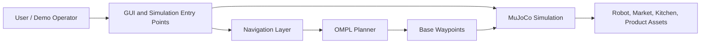
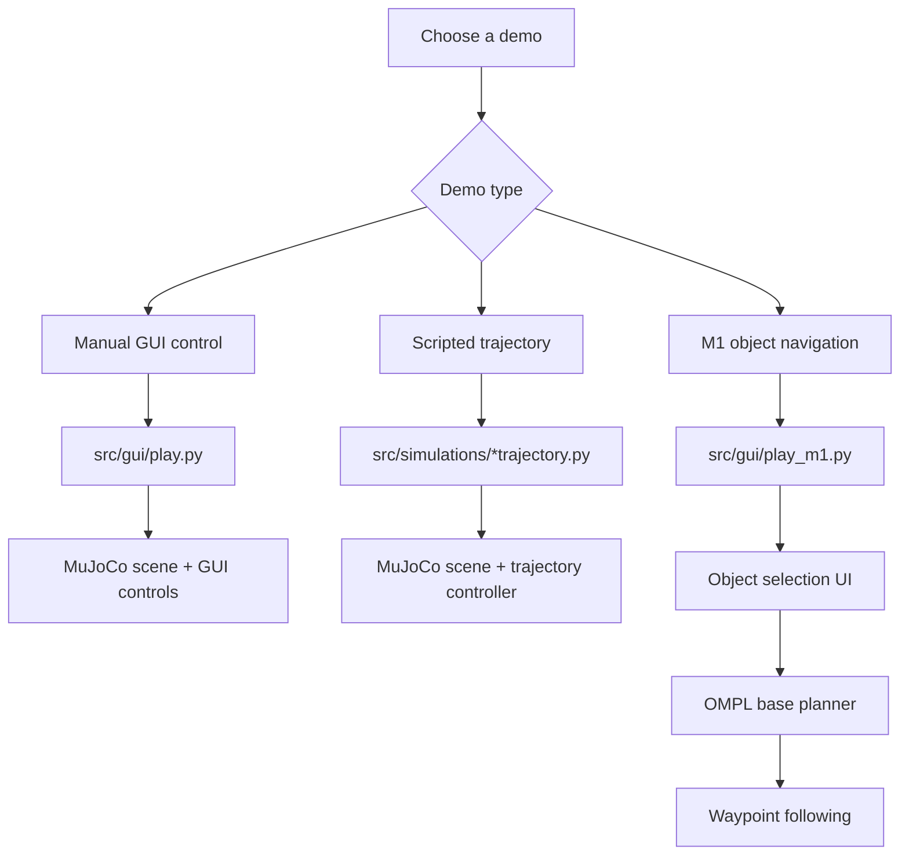
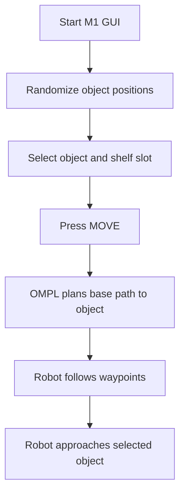

# Project Overview

This repository contains MuJoCo simulation demos for the MORPH mobile manipulator platform. It includes manual GUI control, scripted trajectory demos, and an M1 object-navigation workflow using OMPL-assisted base planning.

<p align="center">
  
</p>

## Main Capabilities

| Capability | Entry Point | Description |
| --- | --- | --- |
| MORPH-I GUI control | `src/gui/play.py` | Interactive GUI for base, dual arms, grippers, wrists, and hand bearings. |
| MORPH-I free movement | `src/simulations/morph_i_free_move.py` | MORPH-I simulation backend with GLFW and OpenCV run modes. |
| MORPH-I scripted market trajectory | `src/simulations/morph_i_market_trajectory.py` | Scripted market-world trajectory demo with trajectory and keyboard modes. |
| MORPH-II free movement | `src/simulations/morph_ii_free_move.py` | MORPH-II kitchen-world free movement demo. |
| MORPH-II scripted kitchen trajectory | `src/simulations/morph_ii_kitchen_trajectory.py` | Scripted MORPH-II kitchen trajectory demo. |
| M1 object navigation | `src/gui/play_m1.py` | Object selection UI, OMPL base navigation, and waypoint following toward the selected object. |

## Visual Demo Summary

| Workflow | Preview | Description |
| --- | --- | --- |
| MORPH-I GUI |  | Main interactive control panel for base, arms, grippers, wrists, and hand bearings. |
| MORPH-I free move |  | GLFW view of the MORPH-I free movement environment. |
| MORPH-I trajectory |  | Scripted market-world trajectory demo. |
| MORPH-II free move |  | MORPH-II free movement environment. |
| MORPH-II trajectory |  | Scripted MORPH-II kitchen trajectory demo. |
| M1 object navigation |  | Object selection, OMPL-assisted base path planning, and waypoint following toward the selected object. |

## Project Structure

```text
motion-planning/
├── README.md
├── requirements.txt
├── Makefile
├── docs/
│   ├── PROJECT_OVERVIEW.md
│   └── RUNNING_DEMOS.md
├── tools/
│   └── smoke_test.py
├── assets/
└── src/
    ├── env/
    ├── gui/
    ├── modules/
    ├── navigation/
    └── simulations/
```

## Key File Reference

| Path | Purpose |
| --- | --- |
| `README.md` | GitHub landing page, quick start, demo gallery, main commands, and scope summary. |
| `requirements.txt` | Python dependencies used by the local virtual environment. |
| `Makefile` | Main user commands for setup, smoke testing, GUI demos, trajectory demos, and recording modes. |
| `tools/smoke_test.py` | Validates important Python imports and key MuJoCo XML scene files before running GUI demos. |
| `assets/` | Screenshots and videos used by the public documentation. |
| `src/env/` | MuJoCo robot, market, kitchen, shelf, furniture, and object scene assets. |
| `src/gui/play.py` | Main MORPH-I manual-control GUI. |
| `src/gui/play_m1.py` | M1 object-selection and OMPL-assisted base-navigation GUI. |
| `src/simulations/` | Standalone free-move and scripted trajectory demo entry points. |
| `src/modules/pubsub.py` | ZMQ command publisher/subscriber support for interactive control topics. |
| `src/modules/trajectory_opt.py` | Polynomial trajectory helper used by scripted demos. |
| `src/navigation/plan.py` | OMPL planner entry point used by the M1 navigation workflow. |
| `src/navigation/ompl_windows_bridge.py` | Bridge used by the M1 GUI to call the planner in native Linux or WSL-style environments. |
| `src/navigation/grasp_controller.py` | Prototype grasp/carry controller logic kept for follow-up development and validation. |

## Main Components



## Run-Time Paths



### MuJoCo Assets

`src/env/` contains the robot, market, kitchen, furniture, and product assets used by the demos.

Important scene files:

- `src/env/market_world_plain.xml`
- `src/env/market_world.xml`
- `src/env/market_world_m1.xml`
- `src/env/kitchen_world.xml`

### GUI Demos

`src/gui/play.py` is the main manual-control interface for MORPH-I.

`src/gui/play_m1.py` adds object labels, shelf-slot labels, object/shelf selection, OMPL base navigation, and navigation status.

### Simulation Scripts

`src/simulations/` contains standalone demos for free movement and scripted trajectories. Most scripts support:

- `--run glfw` for interactive GUI rendering.
- `--run cv --record` for OpenCV rendering and MP4 output.

### Navigation

`src/navigation/plan.py` is a small OMPL planner that receives JSON and returns path waypoints.

`src/navigation/ompl_windows_bridge.py` connects the GUI to the planner. It supports:

- `OMPL_BRIDGE_MODE=native` for native Linux.
- `OMPL_BRIDGE_MODE=wsl` for Windows/WSL setups.

`src/navigation/grasp_controller.py` contains prototype grasp/carry logic. Treat it as follow-up development until it has been validated for the target pick-and-place behavior.

## Current Implementation Notes

- The M1 UI supports object selection and shelf-slot selection.
- The current M1 flow is documented as object selection plus OMPL-assisted base navigation toward the selected object.
- The selected shelf slot is displayed in the UI for task context, but autonomous placement onto the selected shelf is not included in the current implementation.
- Grasp/carry logic exists as prototype code and should be validated before presenting the system as complete autonomous pick-and-place.
- ROS 2, MoveIt2, and Rerun integrations are outside this repository.

## M1 Object Navigation Flow



The selected shelf slot is shown in the UI for task context. Complete autonomous grasp/carry and shelf placement are follow-up extensions.

## M1 GUI Visual Reference

| View | Preview | Use |
| --- | --- | --- |
| Object and shelf selection |  | Shows the object labels, shelf-slot labels, dropdowns, and status bar before navigation starts. |
| Object navigation scene |  | Shows the robot, selected object, market shelves, and navigation context used by the M1 demo. |

## Recommended Setup Path

Use the local Python setup first:

```bash
make setup
make smoke
make gui
```

After setup, run the required demo through the Makefile targets listed in `README.md` and `docs/RUNNING_DEMOS.md`. The Makefile uses `.venv/bin/python` for these commands.
