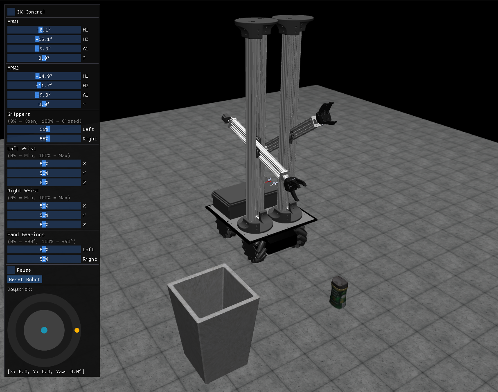
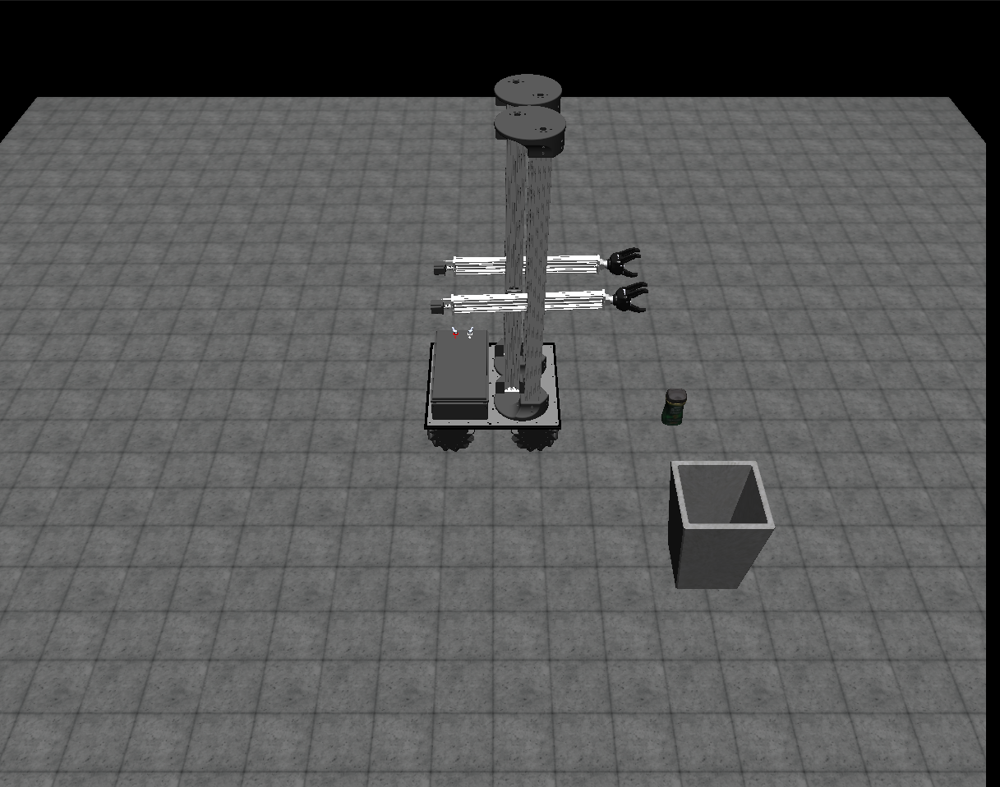
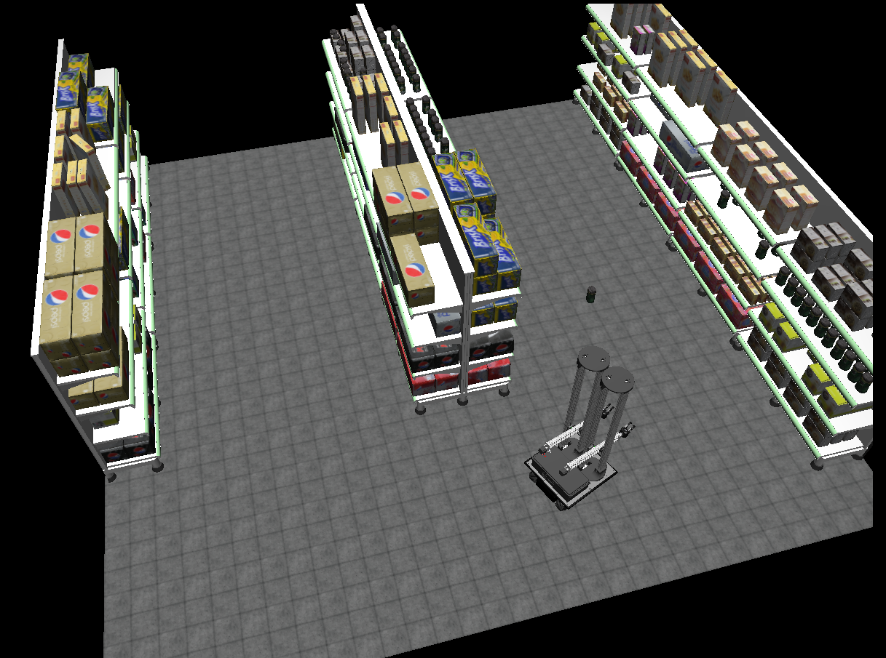
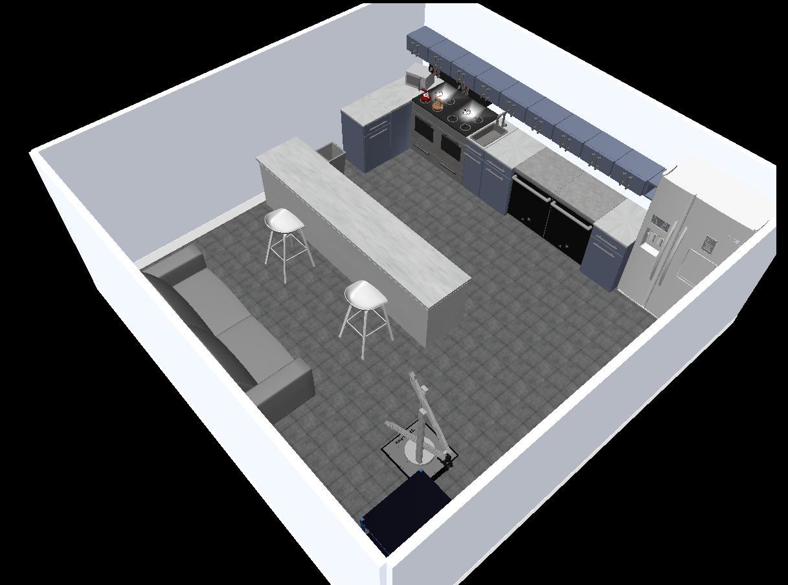
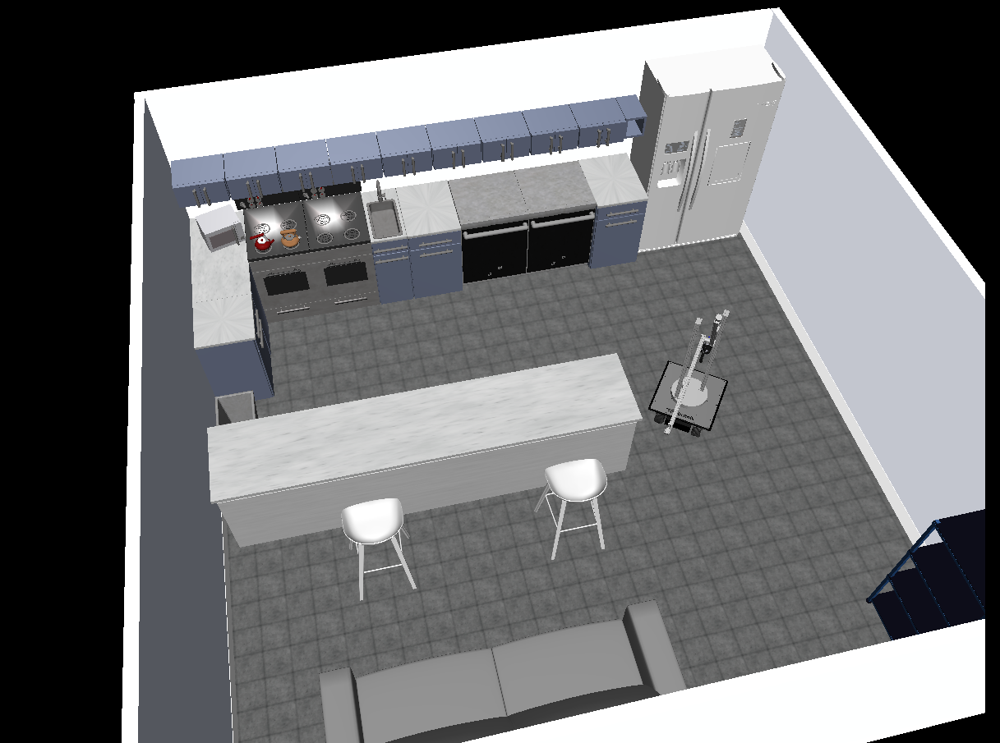
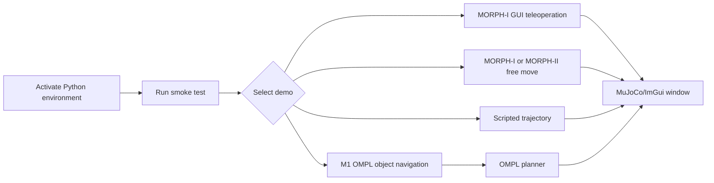
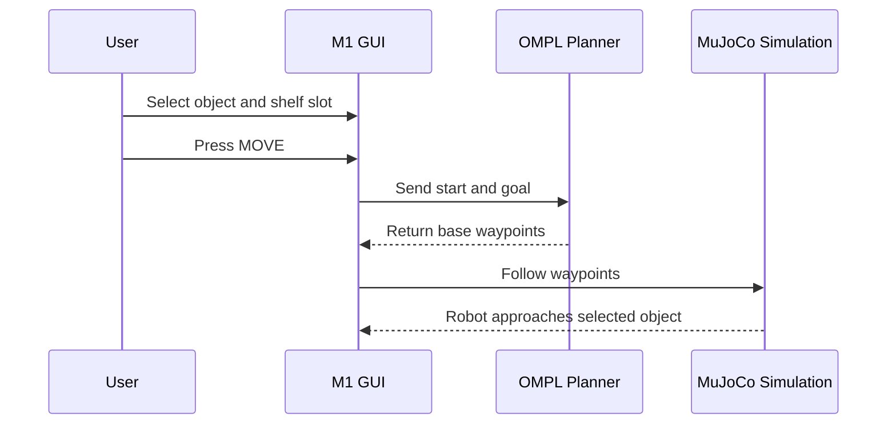

# Running Demos

This guide lists the main demos and the commands needed to run them.

## Demo Matrix

| Demo | Make Command | Direct Python Command | Preview |
| --- | --- | --- | --- |
| MORPH-I GUI | `make gui` | `PYTHONPATH=src .venv/bin/python src/gui/play.py` |  |
| MORPH-I free move | `make morph-i` | `PYTHONPATH=src .venv/bin/python src/simulations/morph_i_free_move.py --run glfw` |  |
| MORPH-I trajectory | `make traj-i` | `PYTHONPATH=src .venv/bin/python src/simulations/morph_i_market_trajectory.py --run glfw --control trajectory` |  |
| MORPH-II free move | `make morph-ii` | `PYTHONPATH=src .venv/bin/python src/simulations/morph_ii_free_move.py --run glfw` |  |
| MORPH-II trajectory | `make traj-ii` | `PYTHONPATH=src .venv/bin/python src/simulations/morph_ii_kitchen_trajectory.py --run glfw --control trajectory` |  |
| M1 OMPL object navigation | `make m1` | `OMPL_BRIDGE_MODE=native PYTHONPATH=src .venv/bin/python src/gui/play_m1.py` |  |

## Demo Selection Flow



## Setup

Check that Python 3.10 is available:

```bash
python3.10 --version
```

On Ubuntu 22.04, install Python 3.10 and the virtual-environment package if needed:

```bash
sudo apt-get update
sudo apt-get install -y python3.10 python3.10-venv python3-pip
```

Ubuntu 24.04 uses Python 3.12 by default. If `python3.10 --version` fails on Ubuntu 24.04, use an Ubuntu 22.04 environment or install Python 3.10 separately before running this project.

Create the Python environment and install dependencies:

```bash
make setup
```

Python 3.10 is recommended because the OMPL Python wheels used by the M1 navigation demo are Python-version specific.

The Makefile and the direct Python commands below use `.venv/bin/python`, so run `make setup` before launching demos.

On Linux, install system display/rendering libraries if GLFW/OpenCV windows fail:

```bash
sudo apt-get update
sudo apt-get install -y libgl1 libglfw3 libglew2.2 libosmesa6 ffmpeg
```

## Recommended First Run

Run the smoke test:

```bash
make smoke
```

For the M1 object-navigation demo, the smoke test should include `[OK] import ompl`.

Run the primary GUI:

```bash
make gui
```

For later runs, use the required Make command directly. If using a direct Python command, keep the `.venv/bin/python` prefix shown below.

## Demo Commands

### MORPH-I GUI Teleoperation

Make command:

```bash
make gui
```

Direct Python:

```bash
PYTHONPATH=src .venv/bin/python src/gui/play.py
```

This opens the main MORPH-I control GUI.

Controls:

- Inner joystick: base translation.
- Outer joystick ring: base yaw.
- `IK Control`: switch between Cartesian IK arm targets and direct joint sliders.
- Arm sliders: move MORPH-I left/right arm joints.
- Gripper sliders: open/close grippers.
- Wrist/bearing sliders: adjust gripper orientation.
- `Reset Robot`: reset to the home configuration.

### MORPH-I Free Move

Make command:

```bash
make morph-i
```

Direct Python:

```bash
PYTHONPATH=src .venv/bin/python src/simulations/morph_i_free_move.py --run glfw
```

OpenCV recording mode:

```bash
PYTHONPATH=src .venv/bin/python src/simulations/morph_i_free_move.py --run cv --record
```

### MORPH-I Market Trajectory

Make command:

```bash
make traj-i
```

Direct Python:

```bash
PYTHONPATH=src .venv/bin/python src/simulations/morph_i_market_trajectory.py --run glfw --control trajectory
```

Keyboard mode:

```bash
PYTHONPATH=src .venv/bin/python src/simulations/morph_i_market_trajectory.py --run glfw --control keyboard
```

### MORPH-II Free Move

Make command:

```bash
make morph-ii
```

Direct Python:

```bash
PYTHONPATH=src .venv/bin/python src/simulations/morph_ii_free_move.py --run glfw
```

### MORPH-II Kitchen Trajectory

Make command:

```bash
make traj-ii
```

Direct Python:

```bash
PYTHONPATH=src .venv/bin/python src/simulations/morph_ii_kitchen_trajectory.py --run glfw --control trajectory
```

### M1 OMPL Object Navigation

Make command:

```bash
make m1
```

Direct Python:

```bash
OMPL_BRIDGE_MODE=native PYTHONPATH=src .venv/bin/python src/gui/play_m1.py
```

This demo:

1. Loads the M1 market world.
2. Randomizes pickup object positions.
3. Lets the user select an object and shelf slot.
4. Uses OMPL to plan base navigation to the object.
5. Follows the generated waypoints toward the selected object.

Note: the shelf-slot selector is present for task context, but autonomous placement onto the selected shelf is not part of the current flow. Grasp/carry logic exists as prototype code and should be validated before presenting the system as complete autonomous pick-and-place.

#### Using the M1 GUI

Use the M1 GUI for the documented object-navigation workflow:

| Control | Use |
| --- | --- |
| `Object ID` dropdown | Select the pickup object that the robot should navigate toward. The selected object is highlighted in the scene and shown in the bottom status bar. |
| `Shelf Slot ID` dropdown | Select a target shelf slot for task context. In the current workflow this selection is displayed but not used for autonomous shelf placement. |
| `MOVE` button | Requests an OMPL base path to the selected object and starts waypoint following. |
| Bottom status bar | Shows the selected object, selected shelf slot, and current navigation state. |
| `Cancel` | Stops the active navigation attempt if the robot is moving. |
| `Respawn Objects` | Randomizes the object positions and sizes in the scene. Use this before a new navigation test if needed. |
| `Pause` | Pauses or resumes the simulation. |
| `Reset Robot` | Resets the robot state to its home configuration. |
| Joystick inner circle | Manual base translation. |
| Joystick outer ring | Manual base yaw/rotation. |
| Arm and gripper sliders | Manual/prototype controls. They are not required for the documented M1 object-navigation demo. |

Recommended demo flow:

1. Start `make m1`.
2. Select an object from `Object ID`.
3. Optionally select a shelf slot to show task context.
4. Press `MOVE`.
5. Watch the status bar and robot motion as the base moves toward the selected object.
6. Stop the demo after the navigation behavior is visible.

Visual references:

| View | Preview |
| --- | --- |
| Object and shelf selection |  |
| Object navigation scene |  |

Demo videos:

- [M1 object navigation](../assets/demo_m1_object_navigation.mp4)
- [M1 object navigation top view](../assets/demo_m1_object_navigation_top_view.mp4)

Expected M1 visual flow:



## ZMQ Command Publisher

Start MORPH-I free move first:

```bash
PYTHONPATH=src .venv/bin/python src/simulations/morph_i_free_move.py --run glfw
```

Then publish commands from another terminal:

```bash
PYTHONPATH=src .venv/bin/python src/simulations/pubsub.py pub target_base list '[3.0, -6.0, 0.0]'
PYTHONPATH=src .venv/bin/python src/simulations/pubsub.py pub target_left list '[0.3, 0.0, 0.6]'
PYTHONPATH=src .venv/bin/python src/simulations/pubsub.py pub target_right list '[-0.3, 0.0, 0.6]'
PYTHONPATH=src .venv/bin/python src/simulations/pubsub.py pub ik_mode bool true
PYTHONPATH=src .venv/bin/python src/simulations/pubsub.py pub u_control list '[0,0,0,0,0,0,0,0]'
```

## Output Videos

The `--run cv --record` modes save videos under:

```text
output_videos/
```

The output folder contains generated recordings and can be safely deleted between runs.

## Troubleshooting

Run `make smoke` first when diagnosing setup problems. It checks the core Python imports, verifies OMPL for the M1 demo, and loads the main MuJoCo XML scenes.

| Symptom | Likely Cause | Recommended Fix |
| --- | --- | --- |
| `python3.10: command not found` when running `make setup` | Python 3.10 is not installed on the machine. | On Ubuntu 22.04, run `sudo apt-get install -y python3.10 python3.10-venv python3-pip`. On Ubuntu 24.04, use an Ubuntu 22.04 environment or install Python 3.10 separately before setup. |
| `.venv/bin/python: not found` when running a demo | The virtual environment has not been created yet. | Run `make setup` from the repository root first. |
| `ModuleNotFoundError` for `mujoco`, `glfw`, `imgui`, `cv2`, `zmq`, or `ompl` | Dependencies are not installed in the project virtual environment. | Run `make setup`, then run demos through the Makefile commands. If using direct Python commands, use the `.venv/bin/python` commands shown above. |
| GUI window does not open or GLFW reports display/OpenGL errors | Missing display, OpenGL, or GLFW system libraries. | On Ubuntu, install the display/rendering packages shown in the setup section, then run the demo again from a desktop session. |
| GUI does not open from WSL2 | WSL GUI/display support is not available or not configured. | Use Windows 11 WSLg where possible. For older setups, configure an X server and OpenGL forwarding before running GLFW demos. |
| `make smoke` reports `import ompl` failure | OMPL Python bindings are missing or installed for a different Python version. | Use Python 3.10 and rerun `make setup`. The M1 demo requires OMPL. For non-M1-only checks, run `ALLOW_MISSING_OMPL=1 make smoke`. |
| MuJoCo XML files fail to load | Command is being run from the wrong folder, or assets are missing. | Run commands from the repository root. Use `make smoke` to identify which scene file fails. |
| Direct Python command cannot import local modules | `PYTHONPATH=src` was not set, or the command used a different Python environment. | Prefer the Makefile commands. For direct commands, include `PYTHONPATH=src` and use `.venv/bin/python`. |
| M1 `MOVE` does not navigate | OMPL is not available, the planner failed, or the selected target cannot be planned from the current state. | Run `make smoke` and confirm `[OK] import ompl`. Restart `make m1`, select an object, and watch the terminal for planner output. |
| Recording mode does not create a video | The script was not run in OpenCV recording mode or `ffmpeg`/video backend support is missing. | Use the documented `--run cv --record` command and confirm `ffmpeg` is installed. Check `output_videos/` after stopping the OpenCV window. |
| M1 shelf selection does not place the object on a shelf | Shelf placement is outside the current implementation scope. | Treat the shelf selector as task context for this handoff. Autonomous shelf placement is a follow-up development item. |
